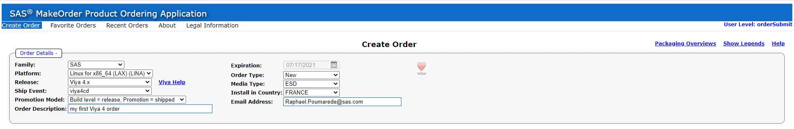
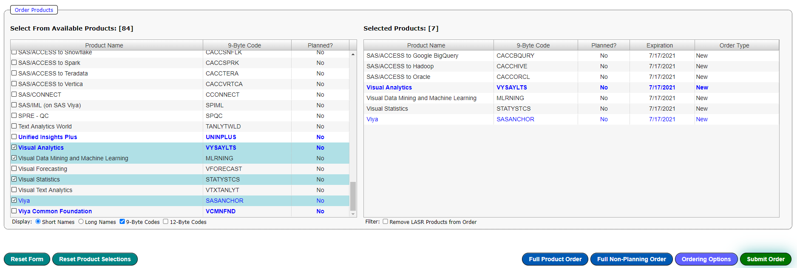
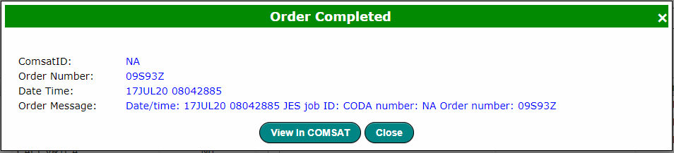
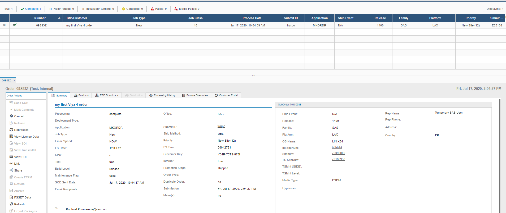
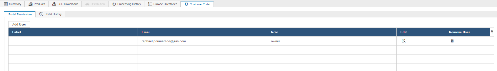
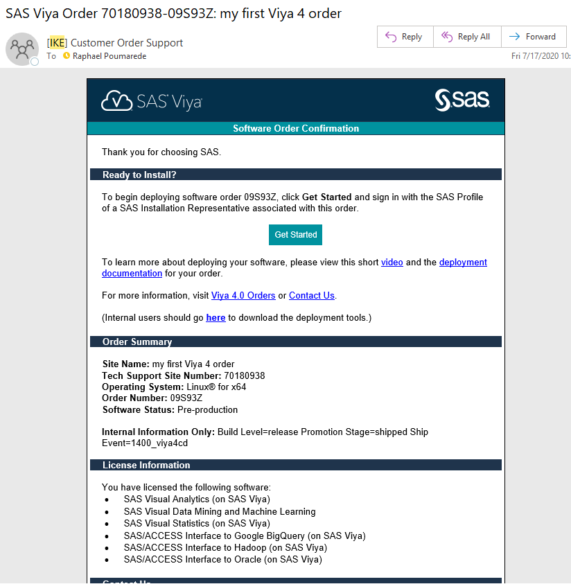
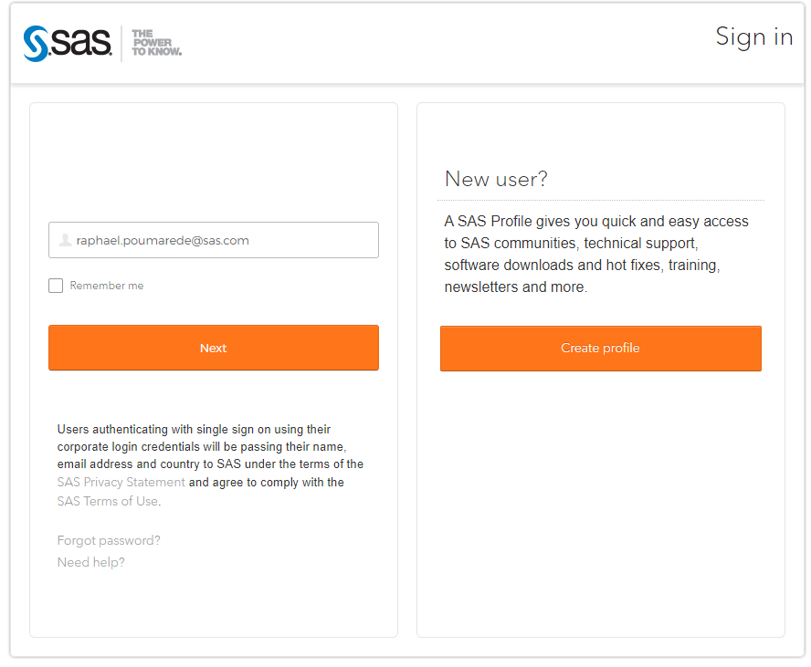
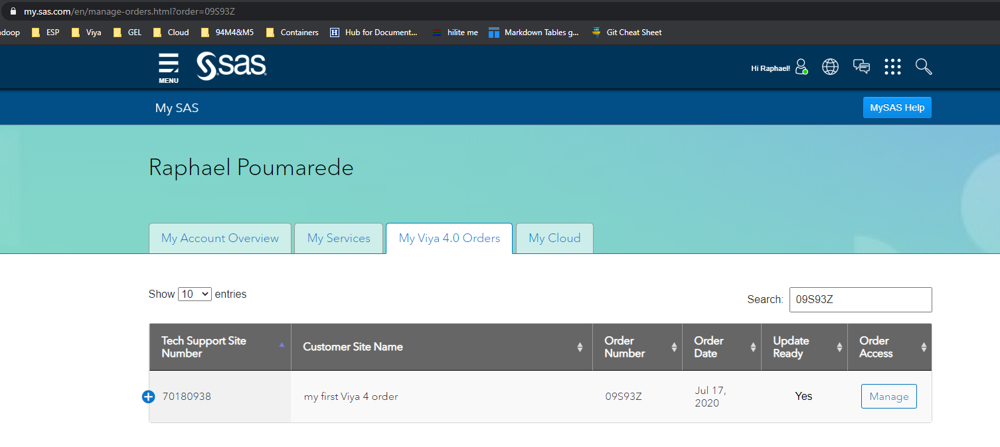
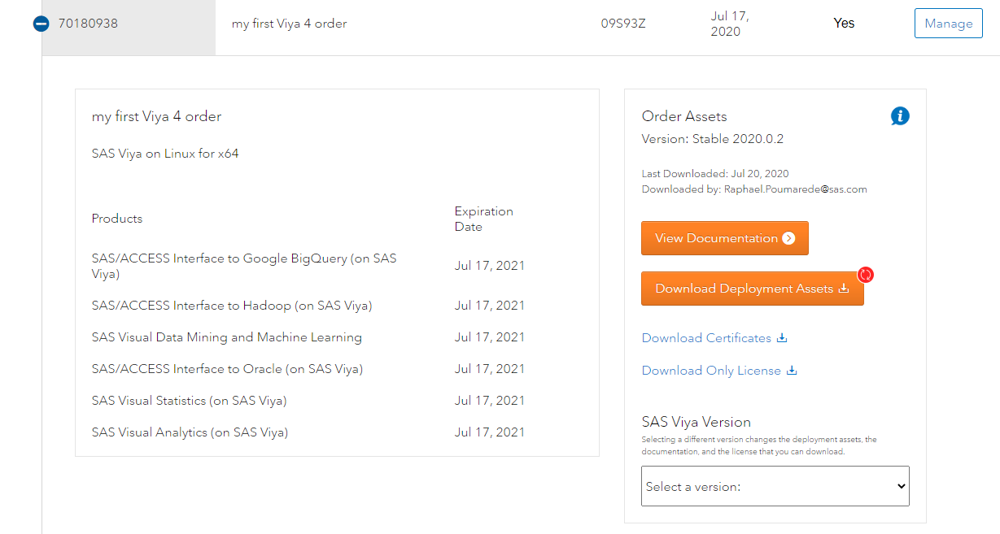

**_Note : In this hands-on we create our own Viya 4 order. We use the internal application "makeorder.sas.com". If you are following this VLE as a partner, you skip this section. It is not a pre-requisite for the following hands-on._**

# Create your own order

## Use "Makeorder" and select your products

* Open the [makeorder.sas.com](https://makeorder.sas.com/makeorder) internal web application.
* Fullfill the header : the platform must be "Linux for x86_64 (LAX) (LINA)" as today it is the only supported platform for Viya 4.

    

* Then you can select some products, for example VA, VS, VDMML and a few SAS/ACCESS engines.

    

* Click on Submit and after a little while, you should see a dialog as below

    

    _Note : the orders starts with "09", it means it is an internal order that can only be deployed inside of the SAS internal network_

* Click on the link to review the order in COMSAT (which is another SAS internal web application)

## Review the order in COMSAT

* The link will open the COMSAT application and show you your own order.

    

* From here you can check the products ordered by the customer, the number of downloads, the Processing history, etc...
* Click on the "Customer portal" tab (this tab is only available for Viya 4 orders)

    

    In this tab we can create another customer account to access the order in the portal. We can also view the access history.

    _Note: COMSAT allows you to see any type of SAS order (SAS 9, Viya 3.x, Viya 4, interal and external)_

## Download your Order's deployment assets

After creating your order, you will shortly receive an email similar to the one below.



If you click on the link "Get Started", it will open up the SAS Portal page.



You will have to sign-in (or) create an account if you don't have one.

Once logged in, you should be able to see your order.



```IMPORTANT: If you don't see your order in the SAS Portal, try to do it from in "incognito" mode or retry after a clean up of your web browser history/cookies.```

Click on the blue "plus" icon and you will see the order details



Now you can pick a version and click on "Download Deployment Assets" to download an archive of the files that you will need for the Viya 4 Deployment.

## Conclusion

We will not use this internal order during the rest of the Hands-on as the remaining of the steps happens in the RACE.EXNET environment which does not have access to the SAS Internal network.
However, we have seen what it takes to create a Viya 4 order, the kind of information that we can find about a specific order in COMSAT and also how you can get the deployment assets to follow up with the installation steps.

## Navigation

<!-- startnav -->
* [01 Introduction / 01 031 Booking a Lab Environment for the Workshop](/01_Introduction/01_031_Booking_a_Lab_Environment_for_the_Workshop.md)
* [01 Introduction / 01 032 Assess Readiness of Lab Environment](/01_Introduction/01_032_Assess_Readiness_of_Lab_Environment.md)
* [02 Kubernetes and Containers Fundamentals / 02 131 Learning about Namespaces](/02_Kubernetes_and_Containers_Fundamentals/02_131_Learning_about_Namespaces.md)
* [03 Viya 4 Software Specifics / 03 011 Looking at a Viya 4 environment with Visual Tools DEMO](/03_Viya_4_Software_Specifics/03_011_Looking_at_a_Viya_4_environment_with_Visual_Tools_DEMO.md)
* [03 Viya 4 Software Specifics / 03 031 Create your own Viya order](/03_Viya_4_Software_Specifics/03_031_Create_your_own_Viya_order.md)**<-- you are here**
* [04 Pre Requisites / 04 061 Pre Requisites automation with ARKCD](/04_Pre-Requisites/04_061_Pre-Requisites_automation_with_ARKCD.md)
* [05 Deployment tools / 05 121 Setup a Windows Client Machine](/05_Deployment_tools/05_121_Setup_a_Windows_Client_Machine.md)
* [06 Deployment Steps / 06 031 Deploying a simple environment](/06_Deployment_Steps/06_031_Deploying_a_simple_environment.md)
* [06 Deployment Steps / 06 051 Deploying Viya with Authentication](/06_Deployment_Steps/06_051_Deploying_Viya_with_Authentication.md)
* [06 Deployment Steps / 06 061 Deploying in a second namespace](/06_Deployment_Steps/06_061_Deploying_in_a_second_namespace.md)
* [06 Deployment Steps / 06 071 Removing Viya deployments](/06_Deployment_Steps/06_071_Removing_Viya_deployments.md)
* [06 Deployment Steps / 06 215 Deploying a programing only environment](/06_Deployment_Steps/06_215_Deploying_a_programing-only_environment.md)
* [07 Deployment Customizations / 07 051 Adding a local registry to k8s](/07_Deployment_Customizations/07_051_Adding_a_local_registry_to_k8s.md)
* [07 Deployment Customizations / 07 052 Using mirrormgr to populate the local registry](/07_Deployment_Customizations/07_052_Using_mirrormgr_to_populate_the_local_registry.md)
* [07 Deployment Customizations / 07 053 Deploy from local registry](/07_Deployment_Customizations/07_053_Deploy_from_local_registry.md)
* [11 Azure AKS Deployment / 11 011 Creating an AKS Cluster](/11_Azure_AKS_Deployment/11_011_Creating_an_AKS_Cluster.md)
* [11 Azure AKS Deployment / 11 012 Performing Prereqs in AKS](/11_Azure_AKS_Deployment/11_012_Performing_Prereqs_in_AKS.md)
* [11 Azure AKS Deployment / 11 013 Deploying Viya 4 on AKS](/11_Azure_AKS_Deployment/11_013_Deploying_Viya_4_on_AKS.md)
* [11 Azure AKS Deployment / 11 014 Deleting the AKS Cluster](/11_Azure_AKS_Deployment/11_014_Deleting_the_AKS_Cluster.md)
* [11 Azure AKS Deployment / 11 015 Fast track with cheatcodes](/11_Azure_AKS_Deployment/11_015_Fast_track_with_cheatcodes.md)
* [11 Azure AKS Deployment / 11 131 CAS Customizations](/11_Azure_AKS_Deployment/11_131_CAS_Customizations.md)
* [11 Azure AKS Deployment / 11 132 Install monitoring and logging](/11_Azure_AKS_Deployment/11_132_Install_monitoring_and_logging.md)
<!-- endnav -->
