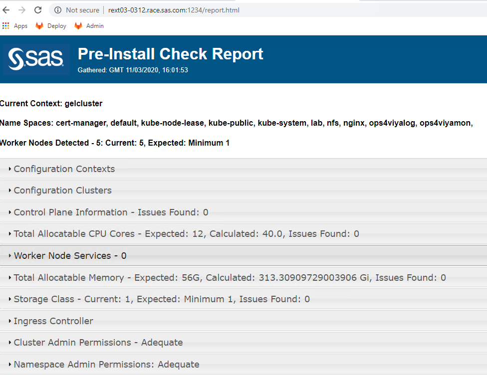

* [Install pre-reqs](#install-pre-reqs)
* [Run Viya ARKcd to create pre-install reports](#run-viya-arkcd-to-create-pre-install-reports)
* [Surface the report](#surface-the-report)
* [Navigation](#navigation)

# Pre-Requisites Automation

With Viya 3.5, the Viya ARK pre-installation playbook was a very handy tool aimed at checking and implementing any required installation pre-requisites.
For Viya 4, a similar tool is under construction.
The SAS Viya Administration Resource Kit for Container Deployments (SAS Viya ARKcd) provides tools and utilities to help SAS customers prepare for a SAS Viya deployment.

The version of Viya ARKcd pre-req checker tool is available here (if you have a GitHub account and have been added to the authorized group):
<https://github.com/sassoftware/viya4-ark/tree/master>

It will become publicly available when the GA release of Viya 4 ships

* Let's clone the viya4-ark tool from GitHub

    ```bash
    git clone https://github.com/sassoftware/viya4-ark.git
    ```

Before GA, it will only works if you have a github account and have registered to have access. In the while you can get the tool from the payload archive.

* If it asks for a username and password, then use the version that we placed in the payload.

    ```bash
    cp -R $HOME/payload/viyaarkcd/ $HOME/viya4-ark
    # the following did not work for me: 
    #cp -R $HOME/payload/viya4arkcd $HOME/viya4-ark
    ```

## Install pre-reqs

* We install the Viya ARK pre-reqs with python pip

    ```bash
    #**# paste this block as separate lines into the shell ... it does not seem to complete if you paste the full block
    # first install python 3
    sudo yum install python3 -y

    cd ~/viya4-ark/
    # install Viya ARK pre-reqs
    sudo python3 -m pip install -r requirements.txt

    # install ComplexHTTPServer (to serve HTML reports)
    sudo pip3.6 install ComplexHTTPServer
    
    ```

## Run Viya ARKcd to create pre-install reports

* Set the KUBECONFIG and run the tool to get usage details

    ```bash
    export KUBECONFIG=~/.kube/config
    # display tool options
    cd ~/viya4-ark/
    python3 viya-ark.py pre-install-report -h
    ```

* You should see something like :

    ```log
    Usage: viya-ark.py pre_install_report <-i|--ingress> <-H|--host> <-p|--port> [<options>]

    Options:
        -i  --ingress=nginx or istio  (Required)Kubernetes ingress controller used for Viya deployment
        -H  --host                    (Required)Ingress host used for Viya deployment
        -p  --port=xxxxx or ""        (Required)Ingress port used for Viya deployment
        -h  --help                    (Optional)Show this usage message
        -n  --namespace               (Optional)Kubernetes namespace used for Viya deployment
        -o, --output-dir="<dir>"      (Optional)Write the report and log files to the provided directory
        -d, --debug                   (Optional)Enables logging at DEBUG level. Default is INFO level
    ```

Otherwise, maybe there is an issue with the version of a python required library :)

* Now it is time to run the tool.

    ```bash
    # we need to provide a namespace, so let's create one that we will use for the deployment
    kubectl create ns lab
    cd ~/viya4-ark/
    # run the viya-ark pre-installation tool
    python3 viya-ark.py pre-install-report -i nginx -H $(hostname -f) -p 443 -n lab
    ```

* After a little while, perhaps 1-2 mins, you should see this message:

    ```log
    Created: /home/cloud-user/viya4-ark/viya_pre_install_report_2020-11-03T11_01_52.html
    Created: viya_pre_install_log_2020-11-03T11_01_52.log
    ```

## Surface the report

* Run the commands below to make the report easily available in the web browser.

    ```bash
    cd ~/viya4-ark/
    # create a symlink to the report.
    ln -s viya_pre_install_report_*.html report.html
    # print report URL
    printf "####\nto access the report from your browser, the url will be:
        http://$(hostname -f):1234/report.html
    ###\n"
    #start ComplexHTTPServer to serve the report
    python3.6 -m ComplexHTTPServer 1234
    ```

Now, you can open the provided URL in the web browser on the RACE Client machine. Review the pre-installation report to ensure that the Kubernetes cluster meets the requirements.



<!-- ## surface the report as a pod

TODO later -->

## Navigation

<!-- startnav -->
* [01 Introduction / 01 031 Booking a Lab Environment for the Workshop](/01_Introduction/01_031_Booking_a_Lab_Environment_for_the_Workshop.md)
* [01 Introduction / 01 032 Assess Readiness of Lab Environment](/01_Introduction/01_032_Assess_Readiness_of_Lab_Environment.md)
* [02 Kubernetes and Containers Fundamentals / 02 131 Learning about Namespaces](/02_Kubernetes_and_Containers_Fundamentals/02_131_Learning_about_Namespaces.md)
* [03 Viya 4 Software Specifics / 03 011 Looking at a Viya 4 environment with Visual Tools DEMO](/03_Viya_4_Software_Specifics/03_011_Looking_at_a_Viya_4_environment_with_Visual_Tools_DEMO.md)
* [03 Viya 4 Software Specifics / 03 031 Create your own Viya order](/03_Viya_4_Software_Specifics/03_031_Create_your_own_Viya_order.md)
* [04 Pre Requisites / 04 061 Pre Requisites automation with ARKCD](/04_Pre-Requisites/04_061_Pre-Requisites_automation_with_ARKCD.md)**<-- you are here**
* [05 Deployment tools / 05 121 Setup a Windows Client Machine](/05_Deployment_tools/05_121_Setup_a_Windows_Client_Machine.md)
* [06 Deployment Steps / 06 031 Deploying a simple environment](/06_Deployment_Steps/06_031_Deploying_a_simple_environment.md)
* [06 Deployment Steps / 06 051 Deploying Viya with Authentication](/06_Deployment_Steps/06_051_Deploying_Viya_with_Authentication.md)
* [06 Deployment Steps / 06 061 Deploying in a second namespace](/06_Deployment_Steps/06_061_Deploying_in_a_second_namespace.md)
* [06 Deployment Steps / 06 071 Removing Viya deployments](/06_Deployment_Steps/06_071_Removing_Viya_deployments.md)
* [06 Deployment Steps / 06 215 Deploying a programing only environment](/06_Deployment_Steps/06_215_Deploying_a_programing-only_environment.md)
* [07 Deployment Customizations / 07 051 Adding a local registry to k8s](/07_Deployment_Customizations/07_051_Adding_a_local_registry_to_k8s.md)
* [07 Deployment Customizations / 07 052 Using mirrormgr to populate the local registry](/07_Deployment_Customizations/07_052_Using_mirrormgr_to_populate_the_local_registry.md)
* [07 Deployment Customizations / 07 053 Deploy from local registry](/07_Deployment_Customizations/07_053_Deploy_from_local_registry.md)
* [11 Azure AKS Deployment / 11 011 Creating an AKS Cluster](/11_Azure_AKS_Deployment/11_011_Creating_an_AKS_Cluster.md)
* [11 Azure AKS Deployment / 11 012 Performing Prereqs in AKS](/11_Azure_AKS_Deployment/11_012_Performing_Prereqs_in_AKS.md)
* [11 Azure AKS Deployment / 11 013 Deploying Viya 4 on AKS](/11_Azure_AKS_Deployment/11_013_Deploying_Viya_4_on_AKS.md)
* [11 Azure AKS Deployment / 11 014 Deleting the AKS Cluster](/11_Azure_AKS_Deployment/11_014_Deleting_the_AKS_Cluster.md)
* [11 Azure AKS Deployment / 11 015 Fast track with cheatcodes](/11_Azure_AKS_Deployment/11_015_Fast_track_with_cheatcodes.md)
* [11 Azure AKS Deployment / 11 131 CAS Customizations](/11_Azure_AKS_Deployment/11_131_CAS_Customizations.md)
* [11 Azure AKS Deployment / 11 132 Install monitoring and logging](/11_Azure_AKS_Deployment/11_132_Install_monitoring_and_logging.md)
<!-- endnav -->
