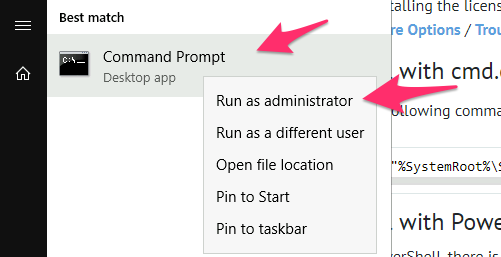

# Setup a Windows Client Machine

This hands-on is OPTIONAL.

Its goal is to show you how to setup various tools on a Windows machine (the one provide in the workshop) and transform it into a Kubernetes Client machine.

There are pros and cons to doing so.

NOTE: None of the other hands-on require you to have done this setup, so if pressed for time, feel free to skip.

## Install Chocolatey (Package Manager for Windows)

1. Get a command prompt with Admin privileges:



1. Run this to install Chocolatey

```dos
@"%SystemRoot%\System32\WindowsPowerShell\v1.0\powershell.exe" -NoProfile -InputFormat None -ExecutionPolicy Bypass -Command " [System.Net.ServicePointManager]::SecurityProtocol = 3072; iex ((New-Object System.Net.WebClient).DownloadString('https://chocolatey.org/install.ps1'))" && SET "PATH=%PATH%;%ALLUSERSPROFILE%\chocolatey\bin"
```

1. Confirm which version you have:

```dos
choco --version
```

should return:

```log
0.10.15
```

## Install Git for windows

```dos
choco install git.install -y
```

## Install Kubectl

```dos
choco install kubernetes-cli -y  --version=1.18.6 --force
```

## Install Kustomize

```dos
choco install kustomize -y --version=3.7.0 --force
```

## Install Helm

```dos
choco upgrade kubernetes-helm -y
```

## Install Lens

```dos
choco upgrade lens -y
```

## Install VSCode and its extensions

```dos
choco upgrade vscode -y
```

```dos
choco upgrade vscode-kubernetes-tools -y
```

```dos
choco upgrade vscode-yaml -y
```

```dos
choco upgrade vscode-gitlens -y
```

## Install putty/pscp

```dos
choco upgrade  putty.install -y
```

## Configure Kubectl

1. Now we need a kubernetes config file. We will pull it down from the linux machine, and onto our Windows client.

1. On our Windows machine, we move to the user's home directory

    ```dos
    cd %HOMEPATH%
    ```

1. Create a .kube folder in the user's home directory

    ```sh
    mkdir  %HOMEPATH%\.kube
    ```

    ```sh
    cd  %HOMEPATH%\.kube
    ```

1. Download the kubeconfig file from the build server (Build Machine) to the windows client machine. (pscp was installed earlier as part of putty)

    ```sh
    "C:\Program Files\PuTTY\pscp.exe" -P 22 cloud-user@sasnode01:/home/cloud-user/.kube/config_portable %HOMEPATH%\.kube\config
    ```

    *Note: you might have to open a new "cmd" windows so pscp command will be recognized.*

1. When prompted to store the key in cache, answer y:

    ```dos
    The server's host key is not cached in the registry. You
    have no guarantee that the server is the computer you
    think it is.
    The server's ssh-ed25519 key fingerprint is:
    ssh-ed25519 256 54:e8:9e:fc:ad:13:3c:a5:f5:ca:5b:c6:d9:2a:a4:47
    If you trust this host, enter "y" to add the key to
    PuTTY's cache and carry on connecting.
    If you want to carry on connecting just once, without
    adding the key to the cache, enter "n".
    If you do not trust this host, press Return to abandon the
    connection.
    Store key in cache? (y/n) y

1. Enter cloud-user's password (lnxsas)

    ```dos
    cloud-user@sasnode01's password:
    ```

1. You should see the file download:

    ```log
    config                    | 5 kB |   5.3 kB/s | ETA: 00:00:00 | 100%
    ```

1. Confirm that the key is now in the correct location:

    ```sh
    dir %HOMEPATH%\.kube\
    ```

    1. should return:

        ```log
        Volume in drive C is Windows 2016
        Volume Serial Number is 4265-E657

        Directory of C:\Users\student\.kube

        01/27/2019  03:46 PM    <DIR>          .
        01/27/2019  03:46 PM    <DIR>          ..
        01/27/2019  03:46 PM             5,464 config
                    1 File(s)          5,464 bytes
                    2 Dir(s)  42,570,838,016 bytes free
        ```

1. At this point, your access to the cluster should be properly configured.

1. To confirm that, run:

    ```dos
    kubectl cluster-info
    ```

    1. You should see (with different IPs)

        ```log
        Kubernetes master is running at https://node3:6443
        CoreDNS is running at https://node3:6443/api/v1/namespaces/kube-system/services/kube-dns:dns/proxy

        To further debug and diagnose cluster problems, use 'kubectl cluster-info dump'.
        ```

1. Query the cluster to see the running pods:

    ```dos
    kubectl get pods --all-namespaces -o wide
    ```

1. You should be able to see some running pods at least in the kube-system namespace

## Navigation

<!-- startnav -->
* [01 Introduction / 01 031 Booking a Lab Environment for the Workshop](/01_Introduction/01_031_Booking_a_Lab_Environment_for_the_Workshop.md)
* [01 Introduction / 01 032 Assess Readiness of Lab Environment](/01_Introduction/01_032_Assess_Readiness_of_Lab_Environment.md)
* [02 Kubernetes and Containers Fundamentals / 02 131 Learning about Namespaces](/02_Kubernetes_and_Containers_Fundamentals/02_131_Learning_about_Namespaces.md)
* [03 Viya 4 Software Specifics / 03 011 Looking at a Viya 4 environment with Visual Tools DEMO](/03_Viya_4_Software_Specifics/03_011_Looking_at_a_Viya_4_environment_with_Visual_Tools_DEMO.md)
* [03 Viya 4 Software Specifics / 03 031 Create your own Viya order](/03_Viya_4_Software_Specifics/03_031_Create_your_own_Viya_order.md)
* [04 Pre Requisites / 04 061 Pre Requisites automation with ARKCD](/04_Pre-Requisites/04_061_Pre-Requisites_automation_with_ARKCD.md)
* [05 Deployment tools / 05 121 Setup a Windows Client Machine](/05_Deployment_tools/05_121_Setup_a_Windows_Client_Machine.md)**<-- you are here**
* [06 Deployment Steps / 06 031 Deploying a simple environment](/06_Deployment_Steps/06_031_Deploying_a_simple_environment.md)
* [06 Deployment Steps / 06 051 Deploying Viya with Authentication](/06_Deployment_Steps/06_051_Deploying_Viya_with_Authentication.md)
* [06 Deployment Steps / 06 061 Deploying in a second namespace](/06_Deployment_Steps/06_061_Deploying_in_a_second_namespace.md)
* [06 Deployment Steps / 06 071 Removing Viya deployments](/06_Deployment_Steps/06_071_Removing_Viya_deployments.md)
* [06 Deployment Steps / 06 215 Deploying a programing only environment](/06_Deployment_Steps/06_215_Deploying_a_programing-only_environment.md)
* [07 Deployment Customizations / 07 051 Adding a local registry to k8s](/07_Deployment_Customizations/07_051_Adding_a_local_registry_to_k8s.md)
* [07 Deployment Customizations / 07 052 Using mirrormgr to populate the local registry](/07_Deployment_Customizations/07_052_Using_mirrormgr_to_populate_the_local_registry.md)
* [07 Deployment Customizations / 07 053 Deploy from local registry](/07_Deployment_Customizations/07_053_Deploy_from_local_registry.md)
* [11 Azure AKS Deployment / 11 011 Creating an AKS Cluster](/11_Azure_AKS_Deployment/11_011_Creating_an_AKS_Cluster.md)
* [11 Azure AKS Deployment / 11 012 Performing Prereqs in AKS](/11_Azure_AKS_Deployment/11_012_Performing_Prereqs_in_AKS.md)
* [11 Azure AKS Deployment / 11 013 Deploying Viya 4 on AKS](/11_Azure_AKS_Deployment/11_013_Deploying_Viya_4_on_AKS.md)
* [11 Azure AKS Deployment / 11 014 Deleting the AKS Cluster](/11_Azure_AKS_Deployment/11_014_Deleting_the_AKS_Cluster.md)
* [11 Azure AKS Deployment / 11 015 Fast track with cheatcodes](/11_Azure_AKS_Deployment/11_015_Fast_track_with_cheatcodes.md)
* [11 Azure AKS Deployment / 11 131 CAS Customizations](/11_Azure_AKS_Deployment/11_131_CAS_Customizations.md)
* [11 Azure AKS Deployment / 11 132 Install monitoring and logging](/11_Azure_AKS_Deployment/11_132_Install_monitoring_and_logging.md)
<!-- endnav -->
