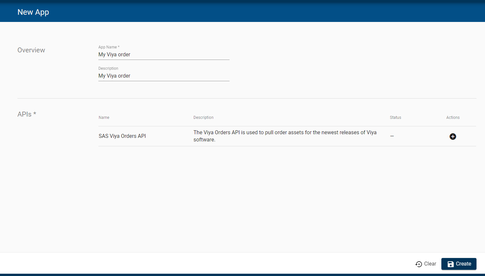

# Getting the Order with the CLI (WORK IN PROGRESS)

The process for obtaining licenses, certificates or deployment assets for an order can be automated, thanks to a handy new command-line tool. The [viya4-orders-cli](https://github.com/sassoftware/viya4-orders-cli) has been developed to programmatically retrieve these files, by running it directly from the command-line or in a Docker image. It’s available on GitHub, but is currently a private repository.

It will become publicly available when the GA release of Viya 4 ships

* Let's clone the viya4-orders-cli tool from GitHub

    ```bash
    git clone https://github.com/sassoftware/viya4-orders-cli.git
    ```

Before GA, it will only works if you have a github account and have registered to have access. In the while you can get the tool from the payload archive.

* If it asks for a username and password, then use the version that we placed in the payload.

    ```bash
    cp -R $HOME/payload/viya4ordercli $HOME
    ```

* Build the go executable

    ```bash
    #first let's install go
    sudo yum install go -y
    go version
    # build the go executable
    # github path
    #cd viya4-orders-cli/
    # playload path
    cd $HOME/viya4ordercli
    go build main.go
    ```

* Open the [SAS API Portal](https://apiportal.sas.com/)

    

* Sign in with your SAS.com account and click on "Apps" in the ribbon.

    

* Click on "New App"

    

* Provide a name and description, click on the "plus" sign to enable the API, then click on "Create"

    

* An API token is created for you (Application ID and secret) an will allow you to access the Order API.

    

* We will, now, copy the **API Key** and **secret** from the SAS Portal and "bas64" encode them (you can use the "Copy" button in the portal).
* Copy the code below in you favorite text editor, replace with your own API key and secret, then copy paste the code in your terminal ans run it.

    ```bash
    echo -n "<your API key>" | base64 > /tmp/clientid.txt
    echo -n "<your secret>" | base64 > /tmp/secret.txt
    echo "clientCredentialsId= "\"$(cat /tmp/clientid.txt)\" > $HOME/.viya4-orders-cli.env
    echo "clientCredentialsSecret= "\"$(cat /tmp/secret.txt)\" >> $HOME/.viya4-orders-cli.env
    ```

* Now you can use the order CLI tool to get the Deployment Assets. You have to provide your own order number ans a specific cadence release.

    ```bash
    go run main.go -c $HOME/.viya4-orders-cli.env dep 9CFB16 stable 2020.0.6
    ```

* You should see something like:

    ```log
    2020/09/29 05:23:48 Using config file: /home/cloud-user/.viya4-orders-cli.env
    OrderNumber: 9CFB16
    AssetName: deploymentAssets
    AssetReqURL: https://api.sas.com/mysas/orders/9CFB16/cadenceNames/stable/cadenceVersions/2020.0.6/deploymentAssets
    AssetLocation: /home/cloud-user/viya4-orders-cli/SASViyaV4_9CFB16_0_stable_2020.0.6_20200924.1600985745738_deploymentAssets_2020-09-29T092352.tgz
    Cadence: Stable 2020.0.6
    CadenceRelease: 20200924.1600985745738
    [cloud-user@rext03-0335 viya4-orders-cli]$
    ```

* Just type ```ls -alrt | grep SASViya``` to make sure there is now a Deployment Assets archive file in the current folder.

    ```log
    -rw-rw-r--   1 cloud-user cloud-user   364187 Sep 29 05:23 SASViyaV4_9CFB16_0_stable_2020.0.6_20200924.1600985745738_deploymentAssets_2020-09-29T092352.tgz
    ```
