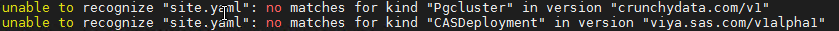
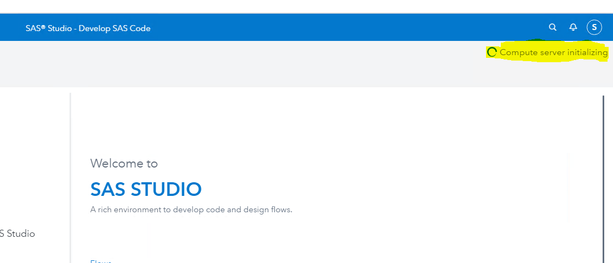
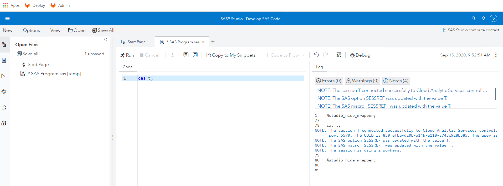
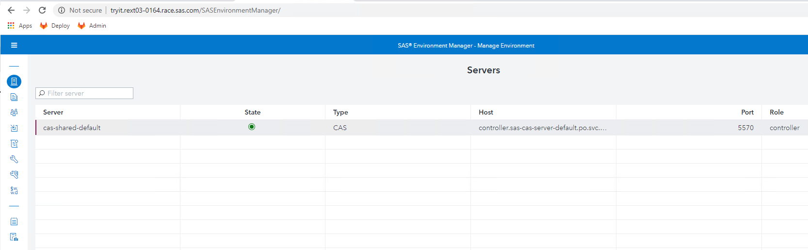

# Deploying a Programming-only environment

* [Overview of steps](#overview-of-steps)
* [Cleaning for a failed attempt (Optional)](#cleaning-for-a-failed-attempt-optional)
* [Prep Steps](#prep-steps)
  * [Prepare standard folder structure](#prepare-standard-folder-structure)
  * [Obtain and extract the Deployment assets](#obtain-and-extract-the-deployment-assets)
  * [Creating a namespace](#creating-a-namespace)
* [Deploy the GELLDAP utility into the "po" namespace](#deploy-the-gelldap-utility-into-the-po-namespace)
  * [Create your Kustomization.yaml file](#create-your-kustomizationyaml-file)
* [Build step](#build-step)
  * [Generate the manifest file](#generate-the-manifest-file)
* [Deploy step](#deploy-step)
  * [Apply the manifest file](#apply-the-manifest-file)
* [Store the URLs for later](#store-the-urls-for-later)
* [watching the environment come up in tmux](#watching-the-environment-come-up-in-tmux)
* [Validation](#validation)
* [Stop and Restart](#stop-and-restart)
* [Reset the default namespace](#reset-the-default-namespace)
* [Navigation](#navigation)

## Overview of steps

1. We will create a namespace called "po"
1. We will create an ingress that has a prefix of "po.".
1. We will deploy a programming only viya env into the "po" namespace.

## Cleaning for a failed attempt (Optional)

If you need to re-run through this exercise and want to make sure that old content is not causing issues, you'd have to clean things up.

The following steps will only work if you go over all this a second time. Skip them the first time around.

1. Empty out the namespace

    ```bash
    ## writing it out the long way:

    kubectl -n po delete deployments --all

    kubectl -n po delete pods --all

    kubectl -n po delete services --all

    kubectl -n po delete persistentvolumeclaims  --all

    ```

1. But deleting the namespace will really make sure we have a clean slate

    ```bash
    kubectl delete ns po

    ```

## Prep Steps

### Prepare standard folder structure

1. Create a working dir for the "po" environment

    ```bash
    rm -rf ~/project/deploy/po/.git
    rm -rf ~/project/deploy/po/*
    mkdir -p ~/project/deploy/po
    mkdir -p ~/project/deploy/po/site-config/
    ```

### Obtain and extract the Deployment assets

1. For this series of exercises, we will use a specific, pre-created order (SAS Data Science Programming)

    ```bash

    # update orders:
    bash -x ~/PSGEL255-deploying-viya-4.0.1-on-kubernetes/scripts/loop/GEL.23.copy.orders.sh start
    # SAS Data Science Programming Order number
    ORDER=9CF3T6
    CADENCE_VERSION=2020.0.4
    #let's get the latest version of this order
    ORDER_FILE=$(ls -t ~/orders/ | grep ${ORDER} | grep ${CADENCE_VERSION} | head -n 1)
    echo $ORDER_FILE

    cp ~/orders/${ORDER_FILE} ~/project/deploy/po/
    cd  ~/project/deploy/po/

    tar xf *.tgz

    ```

1. Confirm that it created the `sas-bases` folder and content by typing ` ls -al ` :

    <details><summary>Click here to see the expected output</summary>

    ```log
    [cloud-user@rext03-0164 po]$ ls -al
    total 272
    drwxrwxr-x 4 cloud-user cloud-user    146 Sep 15 04:28 .
    drwxrwxr-x 3 cloud-user cloud-user     16 Sep 15 04:27 ..
    drwxrwxr-x 6 cloud-user cloud-user    100 Sep 15 04:28 sas-bases
    -rw-r--r-- 1 cloud-user cloud-user 276868 Sep 15 04:28 SASViyaV4_9CF3T6_0_stable_2020.0.4_20200908.1599591986121_deploymentAssets_2020-09-11T075530.tgz
    drwxrwxr-x 2 cloud-user cloud-user      6 Sep 15 04:27 site-config
    ```

    </details>

### Creating a namespace

1. Create a namespace for our "po" environment

    ```bash
    kubectl create ns po
    kubectl get po

    ```

1. Make it the default namespace:

    ```bash
    kubectl config set-context --current --namespace=po
    ```

<!-- ### Creating a sitedefault file

1. Generate a `sitedefault.yaml` just to define the default password for the sasboot account

    ```bash
    tee  ~/project/deploy/po/site-config/sitedefault.yaml > /dev/null << "EOF"
    ---
    config:
      application:
        sas.logon.initial:
          user: sasboot
          password: lnxsas
    EOF
    ``` -->

## Deploy the GELLDAP utility into the "po" namespace

1. The GELLDAP project is located [here](https://gelgitlab.race.sas.com/GEL/utilities/gelldap)

1. Clone the GELLDAP project into the project directory

    ```bash
    cd ~/project/
    git clone https://gelgitlab.race.sas.com/GEL/utilities/gelldap.git
    cd ~/project/gelldap/
    git fetch --all
    GELLDAP_BRANCH=master
    git reset --hard origin/${GELLDAP_BRANCH}

    ```

1. Deploy GELLDAP into the namespace (**do provide the namespace here**)

    ```bash

    cd ~/project/gelldap/
    kustomize build ./no_TLS/ | kubectl -n po apply -f -

    ```

1. To confirm that the service listens on port 389:

    ```bash
    # first, get the service IP:
    kubectl -n po get svc -l app.kubernetes.io/part-of=gelldap,app=gelldap-service -o=custom-columns='IP:spec.clusterIP' --no-headers
    # store it in a variable:
    IP_GELLDAP=$(kubectl -n po get svc -l app.kubernetes.io/part-of=gelldap,app=gelldap-service -o=custom-columns='IP:spec.clusterIP' --no-headers)
    # now curl it:
    curl -v ${IP_GELLDAP}:389

    ```

    You should see:

    ```log
    * About to connect() to 10.43.103.202 port 389 (#0)
    *   Trying 10.43.103.202...
    * Connected to 10.43.103.202 (10.43.103.202) port 389 (#0)
    > GET / HTTP/1.1
    > User-Agent: curl/7.29.0
    > Host: 10.43.103.202:389
    > Accept: */*
    >
    * Empty reply from server
    * Connection #0 to host 10.43.103.202 left intact
    curl: (52) Empty reply from server
    ```

1. The GELLDAP server comes with pre-written sitedefault and sssd information.

1. Let's copy the provided file in the proper location:

    ```bash
    cp ~/project/gelldap/no_TLS/gelldap-sitedefault.yaml \
       ~/project/deploy/po/site-config/

    ```

1. These  two files will be referenced in the kustomization file in the later steps

### Create your Kustomization.yaml file

1. The kustomization.yaml file should have the following content.

    ```bash
    INGRESS_SUFFIX=$(hostname -f)
    echo $INGRESS_SUFFIX

    bash -c "cat << EOF > ~/project/deploy/po/kustomization.yaml
    ---
    namespace: po
    resources:
      - sas-bases/base
      - sas-bases/overlays/network/ingress
      - sas-bases/overlays/internal-postgres
      - sas-bases/overlays/crunchydata
      - sas-bases/overlays/cas-mpp
    transformers:
      - sas-bases/overlays/required/transformers.yaml
      - sas-bases/overlays/internal-postgres/internal-postgres-transformer.yaml
    configMapGenerator:
      - name: ingress-input
        behavior: merge
        literals:
          - INGRESS_HOST=po.${INGRESS_SUFFIX}
      - name: sas-shared-config
        behavior: merge
        literals:
          #- SAS_URL_SERVICE_TEMPLATE=http://po.${INGRESS_SUFFIX}
          - CASCFG_SERVICESBASEURL=http://po.${INGRESS_SUFFIX}
          - SERVICES_BASE_URL=http://po.${INGRESS_SUFFIX}
          - SAS_SERVICES_URL=http://po.${INGRESS_SUFFIX}
          - SAS_URL_SERVICE_TEMPLATE=http://@k8s.service.name@

      - name: sas-consul-config            ## This injects content into consul. You can add, but not replace
        behavior: merge
        files:
          - SITEDEFAULT_CONF=site-config/gelldap-sitedefault.yaml # point to our GELLDAP configured site-default

    EOF"

    ```

## Build step

### Generate the manifest file

1. At this point, we are ready to generate the manifest

    ```bash
    cd ~/project/deploy/po
    kustomize build -o site.yaml

    ```

## Deploy step

### Apply the manifest file

1. We are now ready to Apply this manifest to our cluster:

    For the first time, (because we want the operator to start first) :

    ```bash
    cd ~/project/deploy/po
    export NS="po"
    #start cluster-wide operators and applications
    kubectl apply -n ${NS} -f site.yaml --selector="sas.com/admin=cluster-wide" --prune --prune-whitelist=apps/v1/Deployment --prune-whitelist=core/v1/Service --prune-whitelist=core/v1/ConfigMap --prune-whitelist=extensions/v1beta1/Ingress
    #start cluster-local applications
    kubectl apply -n ${NS} -f site.yaml --selector="sas.com/admin=cluster-local" --prune --prune-whitelist=apps/v1/Deployment --prune-whitelist=core/v1/Service --prune-whitelist=core/v1/ConfigMap --prune-whitelist=extensions/v1beta1/Ingress
    #start namespace applications
    kubectl apply -n ${NS} -f site.yaml --selector="sas.com/admin=namespace" --prune --prune-whitelist=apps/v1/Deployment --prune-whitelist=core/v1/Service --prune-whitelist=core/v1/ConfigMap --prune-whitelist=extensions/v1beta1/Ingress
    ```

    For the next time just run :

    ```bash
    cd ~/project/deploy/po
    kubectl -n po apply  -f site.yaml

    ```

    Doing this will create all required content in kubernetes and start up the process.

    Although the `  -n pod  ` is not required (because it was hard-coded throughout the `site.yaml` file), I strongly encourage you to make it a habit to always specify it.

1. If you receive messages similar to the following, rerun the apply command.

   

## Store the URLs for later

1. No point in connecting yet, but let's store the URLs in a file, for later user

    ```bash
    printf "\n* [Viya Studio (po) URL (HTTP )](http://po.$(hostname -f)/SASStudio )\n\n" | tee -a /home/cloud-user/urls.md
    printf "\n* [Viya Studio (po) URL (HTTP**S**)](https://po.$(hostname -f)/SASStudio )\n\n" | tee -a /home/cloud-user/urls.md
    printf "\n* [Viya Environment Manager (po) URL (HTTP)](http://po.$(hostname -f)/SASEnvironmentManager )\n\n" | tee -a /home/cloud-user/urls.md
    printf "\n* [Viya Environment Manager (po) URL (HTTP**S**)](https://po.$(hostname -f)/SASEnvironmentManager )\n\n" | tee -a /home/cloud-user/urls.md
    ```

1. Whenever you want to see the URLs for YOUR environment, execute:

    ```bash
    cat ~/urls.md
    ```

## watching the environment come up in tmux

1. This will kick off a tmux session called "po_watch":

    ```sh
    #watch kubectl get pods -o wide -n po

    SessName=po_watch

    tmux new -s $SessName -d
    tmux send-keys -t $SessName "time gel_OKViya4 -n po --manifest ~/project/deploy/po/site.yaml --wait --pod-status"  C-m
    tmux split-window -v -t $SessName
    tmux send-keys -t $SessName "watch 'kubectl get pods -o wide -n po | grep 0/ | grep -v Completed '"  C-m

    # or, wait for:
    kubectl wait -n po --for=condition=ready pod --selector='app.kubernetes.io/name=sas-readiness'  --timeout=2700s
    # to return

    ```

1. And this will attach you to it:

    ```sh
    tmux attach -t $SessName
    ```

In this split screen view, you will see a list of pods at the bottom, and a looping script in the top part.

The bottom part is only showing the pods with `0/` in the number of containers. So as time goes by, the list of pods will shrink. When they are all ` 1/1   Running`, your environment is likely ready.

It is unlikely that your environment will be ready in less than 30 minutes, so be patient. (When the "oldest" pod is about 30-35 minutes old, things should be settling down.)

To get out of tmux, press `Ctrl-C` and type `exit` until the green line disappears.

## Validation

At this point, once the environment has finished booting up, you should be able to connect to SAS Studio.

To see the URL you should use, execute:

```bash
cat ~/urls.md | grep po | grep Studio

```

Ctrl-Click on the URL to access it, and log in with:

* User: `sastest1` or `sasadm`
* Password: `lnxsas`

Once inside the SAS Studio Application, you need to wait a little bit for the Compute server to be ready (the Compute server image needs to be pulled on the node where the corresponding Pod has started).



* Connect to SAS Studio and run some code. For example, check that you can create a CAS session.

  

* Connect to SAS Environment manager as "sasadm" (password: lnxsas)

  

<!-- ## Configure CAS external access

### Ingress configuration

* Create the configmap for ingress

    ```sh
    bash -c "cat << EOF > ~/project/deploy/po/castcpservcm.yaml
    apiVersion: v1
    kind: ConfigMap
    metadata:
      name: tcp-services
      namespace: ingress-nginx
    data:
      5570: "po/sas-cas-server-default:5570"
    EOF"
    # apply the CM
    kubectl -n ingress-nginx apply -f ~/project/deploy/po/castcpservcm.yaml
    ```

kubectl get -n ingress-nginx service ingress-nginx -o yaml > ~/project/deploy/po/ingress-ngnx-service -->

## Stop and Restart

if the deployment did not work well the first time, you can try again.

* STOP

```sh
kubectl -n po scale deployments --all --replicas=0
kubectl -n po scale statefulsets --all --replicas=0
kubectl -n po delete casdeployment --all
kubectl -n po delete jobs --all
```

* RESTART

```sh
kubectl -n po apply -f ~/project/deploy/po/site.yaml
kubectl -n po scale deployments --all --replicas=1
kubectl -n po scale statefulsets --all --replicas=1
```

## Reset the default namespace

1. Make 'default' the default namespace again:

    ```sh
    kubectl config set-context --current --namespace=default
    ```

## Navigation

<!-- startnav -->
* [01 Introduction / 01 031 Booking a Lab Environment for the Workshop](/01_Introduction/01_031_Booking_a_Lab_Environment_for_the_Workshop.md)
* [01 Introduction / 01 032 Assess Readiness of Lab Environment](/01_Introduction/01_032_Assess_Readiness_of_Lab_Environment.md)
* [02 Kubernetes and Containers Fundamentals / 02 131 Learning about Namespaces](/02_Kubernetes_and_Containers_Fundamentals/02_131_Learning_about_Namespaces.md)
* [03 Viya 4 Software Specifics / 03 011 Looking at a Viya 4 environment with Visual Tools DEMO](/03_Viya_4_Software_Specifics/03_011_Looking_at_a_Viya_4_environment_with_Visual_Tools_DEMO.md)
* [03 Viya 4 Software Specifics / 03 031 Create your own Viya order](/03_Viya_4_Software_Specifics/03_031_Create_your_own_Viya_order.md)
* [04 Pre Requisites / 04 061 Pre Requisites automation with ARKCD](/04_Pre-Requisites/04_061_Pre-Requisites_automation_with_ARKCD.md)
* [05 Deployment tools / 05 121 Setup a Windows Client Machine](/05_Deployment_tools/05_121_Setup_a_Windows_Client_Machine.md)
* [06 Deployment Steps / 06 031 Deploying a simple environment](/06_Deployment_Steps/06_031_Deploying_a_simple_environment.md)
* [06 Deployment Steps / 06 051 Deploying Viya with Authentication](/06_Deployment_Steps/06_051_Deploying_Viya_with_Authentication.md)
* [06 Deployment Steps / 06 061 Deploying in a second namespace](/06_Deployment_Steps/06_061_Deploying_in_a_second_namespace.md)
* [06 Deployment Steps / 06 071 Removing Viya deployments](/06_Deployment_Steps/06_071_Removing_Viya_deployments.md)
* [06 Deployment Steps / 06 215 Deploying a programing only environment](/06_Deployment_Steps/06_215_Deploying_a_programing-only_environment.md)**<-- you are here**
* [07 Deployment Customizations / 07 051 Adding a local registry to k8s](/07_Deployment_Customizations/07_051_Adding_a_local_registry_to_k8s.md)
* [07 Deployment Customizations / 07 052 Using mirrormgr to populate the local registry](/07_Deployment_Customizations/07_052_Using_mirrormgr_to_populate_the_local_registry.md)
* [07 Deployment Customizations / 07 053 Deploy from local registry](/07_Deployment_Customizations/07_053_Deploy_from_local_registry.md)
* [11 Azure AKS Deployment / 11 011 Creating an AKS Cluster](/11_Azure_AKS_Deployment/11_011_Creating_an_AKS_Cluster.md)
* [11 Azure AKS Deployment / 11 012 Performing Prereqs in AKS](/11_Azure_AKS_Deployment/11_012_Performing_Prereqs_in_AKS.md)
* [11 Azure AKS Deployment / 11 013 Deploying Viya 4 on AKS](/11_Azure_AKS_Deployment/11_013_Deploying_Viya_4_on_AKS.md)
* [11 Azure AKS Deployment / 11 014 Deleting the AKS Cluster](/11_Azure_AKS_Deployment/11_014_Deleting_the_AKS_Cluster.md)
* [11 Azure AKS Deployment / 11 015 Fast track with cheatcodes](/11_Azure_AKS_Deployment/11_015_Fast_track_with_cheatcodes.md)
* [11 Azure AKS Deployment / 11 131 CAS Customizations](/11_Azure_AKS_Deployment/11_131_CAS_Customizations.md)
* [11 Azure AKS Deployment / 11 132 Install monitoring and logging](/11_Azure_AKS_Deployment/11_132_Install_monitoring_and_logging.md)
<!-- endnav -->


