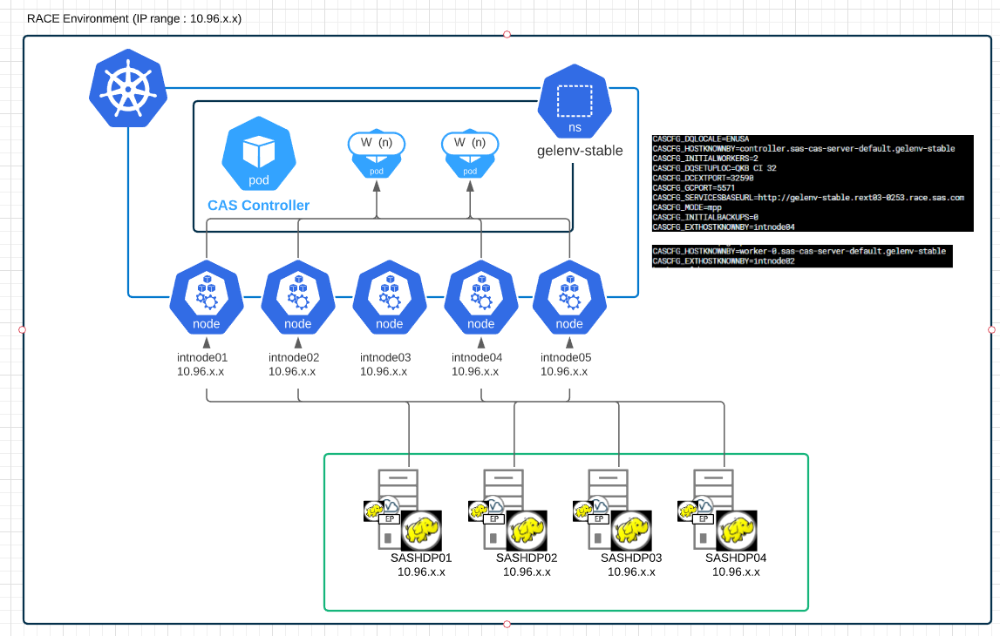
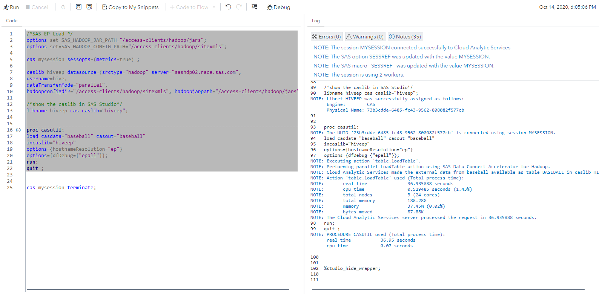
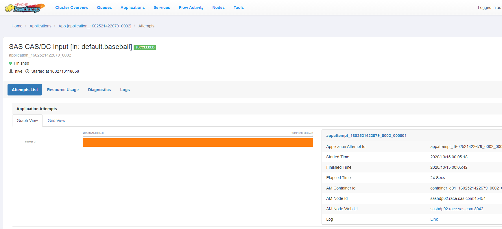

* [Architecture overview](#architecture-overview)
* [Configure Data Connector Node Port service for the EP](#configure-data-connector-node-port-service-for-the-ep)
  * [Add the publishDCNodePortServices in Kustomize](#add-the-publishdcnodeportservices-in-kustomize)
  * [Rebuild the manifests](#rebuild-the-manifests)
  * [Configure Hadoop nodes for NodePort connection](#configure-hadoop-nodes-for-nodeport-connection)
  * [Test a parallel loading with the Embedded Process (NodePort)](#test-a-parallel-loading-with-the-embedded-process-nodeport)

# Parallel loading with the Embedded process for Hadoop

## Architecture overview

The aim of the diagrams below is to illustrate the implementation of the Parrallel loading into CAS from Hadoop using the Data Connect Accelerators and the Embedded Process.
There are basically two possible ways to configure the connection from the EP (located on the Remote HAdoop cluster) to the CAS pods.
Either using the NodePort service or the LoadBalancer service type.

In this hands-on we cover the Node port way.



## Configure Data Connector Node Port service for the EP

<!-- JIRA Epic : https://rndjira.sas.com/browse/ASRCAS-169 -->

### Add the publishDCNodePortServices in Kustomize

* Either manually add the following lines in the transformers section:

    ```yaml
    transformers:
    ...
    - sas-bases/overlays/data-access/enable-dc-ports.yaml
    ```

* Or execute this code for the new transformers references

    ```sh
    yq write  -i ~/project/deploy/gelenv-stable/kustomization.yaml "transformers[+]" "sas-bases/overlays/data-access/data-publish-ports.yaml"
    ```

### Rebuild the manifests

* Build site.yaml

    ```sh
    cd ~/project/deploy/gelenv-stable/
    mv site.yaml site-backup.yaml
    kustomize build -o site.yaml
    ```

* Check the differences

    ```sh
    icdiff site-backup.yaml site.yaml
    ```

* Apply new site.yaml

    ```sh
    kubectl apply -n gelenv-stable -f site.yaml
    ```

* Restart CAS

    ```sh
    kubectl -n gelenv-stable delete pod --selector='app.kubernetes.io/managed-by=sas-cas-operator'
    ```

### Configure Hadoop nodes for NodePort connection

Only one person can do it

* Prepare the /etc/hosts file

    <!-- #echo "$(hostname -i)  controller.sas-cas-server-default.gelenv-stable worker-0.sas-cas-server-default.gelenv-stable worker-1.sas-cas-server-default.gelenv-stable" > /tmp/casnodeporthost.txt
    # or (more likely): -->

  * Get nodes IP address

    ```sh
    NODE1=$(grep sasnode01 /etc/hosts | awk '{print $1}')
    NODE2=$(grep sasnode02 /etc/hosts | awk '{print $1}')
    NODE3=$(grep sasnode03 /etc/hosts | awk '{print $1}')
    NODE4=$(grep sasnode04 /etc/hosts | awk '{print $1}')
    NODE5=$(grep sasnode05 /etc/hosts | awk '{print $1}')
    ```

  * Prepare hosts block

    ```sh
    echo "$NODE1  intnode01" > /tmp/casnodeporthost.txt
    echo "$NODE2  intnode02" >> /tmp/casnodeporthost.txt
    echo "$NODE3  intnode03" >> /tmp/casnodeporthost.txt
    echo "$NODE4  intnode04" >> /tmp/casnodeporthost.txt
    echo "$NODE5  intnode05" >> /tmp/casnodeporthost.txt
    ```

* Transfer

    ```sh
    scp /tmp/casnodeporthost.txt cloud-user@sashdp01:/tmp
    ```

* Connect to sashdp01

    ```sh
    ssh sashdp01
    ```

* Update the /etc/hosts files

    ```sh
    # remove previous entries for intnodes
    ansible -i inventory.ini all -m lineinfile -a "path=/etc/hosts regex='intnode' state=absent backup=yes" -b --diff
    sudo cp /etc/hosts /etc/hosts.orig
    # add the K8s nodes hosts block
    sudo bash -c "cat /tmp/casnodeporthost.txt >> /etc/hosts"
    # distribute /etc/hosts file on all hadoop nodes
    ansible -i inventory.ini all -m copy -a "src=/etc/hosts dest=/etc/hosts owner=root group=root mode=0644" -b --diff
    ```

### Test a parallel loading with the Embedded Process (NodePort)

* Open SASStudio and run the following code, to make sure you can access the Oracle Database tables and load them into CAS.

    ```sh
    /*SAS EP Load */
    options set=SAS_HADOOP_JAR_PATH="/access-clients/hadoop/jars";
    options set=SAS_HADOOP_CONFIG_PATH="/access-clients/hadoop/sitexmls";

    cas mysession sessopts=(metrics=true) ;

    caslib hiveep datasource=(srctype="hadoop" server="sashdp02.race.sas.com",
    username=hive,
    dataTransferMode="parallel",
    hadoopconfigdir="/access-clients/hadoop/sitexmls", hadoopjarpath="/access-clients/hadoop/jars");

    /*show the caslib in SAS Studio*/
    libname hiveep cas caslib="hiveep";


    proc casutil;
    load casdata="baseball" casout="baseball"
    incaslib="hiveep"
    /* don't forget the hostnameResolution option */
    options={hostnameResolution="ep"}
    options={dfDebug={"epall"}};
    run;
    quit ;

    cas mysession terminate;
    ```

* Here is what you should see

    

* See the corresponding YARN application : http://10.96.11.106:8088/ui2/index.html#/yarn-apps/apps :

    

<!-- ## Configure Data Connector LoadBalancer service for the EP

TODO with 0.6
Reference : <http://pubshelpcenter.unx.sas.com:8080/test/?cdcId=itopscdc&cdcVersion=v_006&docsetId=dplyml0phy0dkr&docsetTarget=n08u2yg8tdkb4jn18u8zsi6yfv3d.htm&locale=en#> (search for  LoadBalancer) -->
