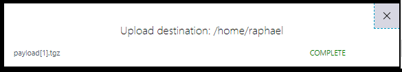
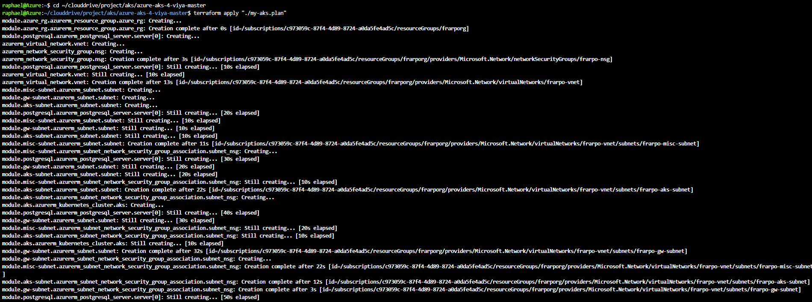

# Creating an AKS cluster

* [Projects](#projects)
  * [GitLab](#gitlab)
  * [GitHub](#github)
* [Initialize your working environment (please READ)](#initialize-your-working-environment-please-read)
  * [Request your gel-sandbox access](#request-your-gel-sandbox-access)
  * [Open the Azure Cloud Shell](#open-the-azure-cloud-shell)
  * [Get the payload tarball in Cloud Shell](#get-the-payload-tarball-in-cloud-shell)
  * [Set up Terraform](#set-up-terraform)
  * [Install Azure CLI](#install-azure-cli)
  * [Authenticate to Azure with the CLI](#authenticate-to-azure-with-the-cli)
  * [Set the Azure CLI defaults](#set-the-azure-cli-defaults)
  * [Obtain the Terraform templates](#obtain-the-terraform-templates)
  * [Initialize Terraform](#initialize-terraform)
  * [Configure the Terraform templates](#configure-the-terraform-templates)
* [Provision the AKS cluster with Terraform](#provision-the-aks-cluster-with-terraform)
  * [Alter default variables in the TF template](#alter-default-variables-in-the-tf-template)
    * [Create the TF variables with Multiple node pools](#create-the-tf-variables-with-multiple-node-pools)
    * [Create TF variables for minimum deployment](#create-tf-variables-for-minimum-deployment)
  * [Generate a Terraform plan](#generate-a-terraform-plan)
* [Stand up AKS cluster and Validate](#stand-up-aks-cluster-and-validate)
  * [Apply the Terraform plan](#apply-the-terraform-plan)
  * [Getting the kubectl config file for your newly built AKS cluster](#getting-the-kubectl-config-file-for-your-newly-built-aks-cluster)
  * [Disable the authorized IP range for the Kubernetes API](#disable-the-authorized-ip-range-for-the-kubernetes-api)
  * [Configure kubectl auto-completion](#configure-kubectl-auto-completion)
* [IMPORTANT FOR THE NEXT TIME : DO NOT REDO EVERYTHING](#important-for-the-next-time--do-not-redo-everything)

## Projects

### GitLab

There is a SAS internal project called "CloudOps4Viya" that uses opensource Hashicorp Terraform and Modules from Terraform Registry to create and configure Azure infrastructure components needed to deploy SAS Viya 4.x products.

<https://gitlab.sas.com/CloudOps4Viya/k8s-quickstarts-tf/azure-aks-4-viya>

We will get and use the Terraform templates from there to automate the AKS cluster provisioning.

### GitHub

The "CloudOps4Viya" should be made available in a public facing GitHub soon.

## Initialize your working environment (please READ)

In the whole AKS hands-on we will use the Azure Cloud Shell.
Azure Cloud Shell is an interactive, authenticated, browser-accessible shell for managing Azure resources. It provides the flexibility of the shell experience (Bash or PowerShell) directly from your web browser.

Behind the scene Azure starts a small container for that with everything you need pre-installed (ansible, az CLI, terraform, git, etc...), so there is no longer a need to provision a jumphost machine to operate your deployment in Azure, just start an Azure Shell and launch the deployment of Viya 4 in AKS from there.

If it is the first time you are using the Azure Cloud Shell, you will be asked to attach an azure file share to persist the files.
If you are not prompted with the question, no worries it means that there is already a storage associated to your Cloud Shell session, and you can proceeed with the Hands-on.

### Request your gel-sandbox access

* Send this [email](mailto:dlmanager@wnt.sas.com?subject=SUBSCRIBE%20azure_gelsandbox) without any change.

* If the link above does not open your default email program, see [this](https://duckduckgo.com/?q=mailto+protocol+default) or simply email dlmanager@wnt.sas.com with subject "SUBSCRIBE azure_gelsandbox".

* DLManager will send an email response in a few minutes confirming your membership in the GELSANDBOX Azure subscription. If membership is successful, continue with the prerequisite steps.

  

### Open the Azure Cloud Shell

Once you have been added in the "sas-gelsandbox" subscription, you can follow the next steps.

* Open <https://portal.azure.com/#home>

  

* Click on Cloud-shell icon

  

Note : you can also directly open the Cloud Shell from this URL : <https://shell.azure.com/>

* If you see the screen below, click on "Bash"

  

* If it is the first time you are using the Azure Cloud Shell, you are asked to attach an azure file share to persist the files you will create during the Cloud Shell session.

  

* If you are not prompted with the question, no worries it means that there is already a storage associated to your Cloud Shell sessions. The Cloud Shell terminal window will open up and you can proceeed with the next [instructions](#get-the-payload-tarball-in-cloud-shell).

* **Otherwhise** click on "Show Advanced Settings", so you can select the resource group, the storage account and a name for the File share that will be attached to the Cloud Shell sessions.

    

* Fulfill the form as in the screenshot (Use your own subscription or create a new Resource Group using your own SAS ID in the name so it will be easier to find it).

* Click on "Create Storage" and after a little while, you should see a nice new bash window.

    

### Get the payload tarball in Cloud Shell

There are a few things that we need to perform the Viya deployment in AKS (it is discussed in the [Prereqs](11_012_Performing_Prereqs_in_AKS.md) section).

The "payload" archive includes all we need and is automatically generated and made available on our good old gelweb server : <https://gelweb.race.sas.com/scripts/PSGEL255/payload/>

Since we will need the content of the payload archive for the next steps and we are preparing the Cloud Shell environment, let's upload it in our Cloud Shell environment.

Click on the "Upload/Download files" button at the top.


Click on "Upload" and copy-paste this URL : <https://gelweb.race.sas.com/scripts/PSGEL255/payload/payload.tgz>

You will see a new dialog that confirm that the archive has been uploaded.



The .tgz file has been uploaded in your home directory (/home/raphael in my case).

* Confirm it by running:

  ```sh
  ls -al ~
  ```

* Now, let's move and extract it to a known location.

  ```sh
  rm -Rf ~/clouddrive/payload
  mv ~/payload*.tgz ~/clouddrive/payload.tgz
  cd ~/clouddrive
  tar -xvf payload.tgz && rm payload.tgz
  ```

* Check that you have everything in the payload folder:

  ```sh
  ls -l ~/clouddrive/payload
  ```

* you should see something like :

  

### Set up Terraform

* Nothing to do since terraform is pre-installed in the Azure Cloud Shell :)

  ```bash
  #show default terraform version
  terraform version
  ```

* ...But... actually we want to pin the Cloud Shell TF to a working version.

  ```bash
  # we stick to 13.3 bc it is the required version from
  TFVERS=0.13.3
  echo "[INFO] installing terraform $TFVERS..."
  mkdir -p ~/bin
  cd ~/bin
  rm -Rf ~/bin/terraform
  curl -o terraform.zip -s https://releases.hashicorp.com/terraform/${TFVERS}/terraform_${TFVERS}_linux_amd64.zip
  unzip terraform.zip && rm -f terraform.zip
  export PATH=$PATH:$HOME/bin
  $HOME/bin/terraform version
  ```

* Why ?

  Azure keeps updating the Terraform version and we want to be sure that we use a supported version for our [Viya IaC templates](https://github.com/sassoftware/viya4-iac-azure).
  For example when the available version in Azure Shell was v0.1.3.1 it did not play well with our TF templates :( (see <https://github.com/hashicorp/terraform/issues/26011>).
  At the moment TF v.0.13.* is in lot of flux - <https://github.com/hashicorp/terraform/pulse>

### Install Azure CLI

* Nothing to do since the "az" cli is pre-installed in the Azure Cloud Shell :)

  ```bash
  #show az CLI version
  az version
  ```

### Authenticate to Azure with the CLI

Cloud Shell is automatically authenticated under the initial account signed-in with.

### Set the Azure CLI defaults

* We need to define the location we want. Let's list the locations, and choose one:

  ```sh
  az account list-locations -o table
  az configure --defaults location=eastus
  ```

  <details><summary>Click here to see a sample output</summary>

  ```log
  [cloud-user@pdcesx04212 ~]$     az account list-locations -o table
  DisplayName           Latitude    Longitude    Name
  --------------------  ----------  -----------  ------------------
  East Asia             22.267      114.188      eastasia
  Southeast Asia        1.283       103.833      southeastasia
  Central US            41.5908     -93.6208     centralus
  East US               37.3719     -79.8164     eastus
  East US 2             36.6681     -78.3889     eastus2
  West US               37.783      -122.417     westus
  North Central US      41.8819     -87.6278     northcentralus
  South Central US      29.4167     -98.5        southcentralus
  North Europe          53.3478     -6.2597      northeurope
  West Europe           52.3667     4.9          westeurope
  Japan West            34.6939     135.5022     japanwest
  Japan East            35.68       139.77       japaneast
  Brazil South          -23.55      -46.633      brazilsouth
  Australia East        -33.86      151.2094     australiaeast
  Australia Southeast   -37.8136    144.9631     australiasoutheast
  South India           12.9822     80.1636      southindia
  Central India         18.5822     73.9197      centralindia
  West India            19.088      72.868       westindia
  Canada Central        43.653      -79.383      canadacentral
  Canada East           46.817      -71.217      canadaeast
  UK South              50.941      -0.799       uksouth
  UK West               53.427      -3.084       ukwest
  West Central US       40.890      -110.234     westcentralus
  West US 2             47.233      -119.852     westus2
  Korea Central         37.5665     126.9780     koreacentral
  Korea South           35.1796     129.0756     koreasouth
  France Central        46.3772     2.3730       francecentral
  France South          43.8345     2.1972       francesouth
  Australia Central     -35.3075    149.1244     australiacentral
  Australia Central 2   -35.3075    149.1244     australiacentral2
  UAE Central           24.466667   54.366669    uaecentral
  UAE North             25.266666   55.316666    uaenorth
  South Africa North    -25.731340  28.218370    southafricanorth
  South Africa West     -34.075691  18.843266    southafricawest
  Switzerland North     47.451542   8.564572     switzerlandnorth
  Switzerland West      46.204391   6.143158     switzerlandwest
  Germany North         53.073635   8.806422     germanynorth
  Germany West Central  50.110924   8.682127     germanywestcentral
  Norway West           58.969975   5.733107     norwaywest
  Norway East           59.913868   10.752245    norwayeast
  [cloud-user@pdcesx04212 ~]$ az configure --defaults location=eastus
  [cloud-user@pdcesx04212 ~]$
  ```

  </details>

<!--
  ```bash
  #set default AZ region
  az configure --defaults location=eastus
  ```
-->

* Now, let's list the subscriptions we have access to and choose the default one:

  ```sh
  az account list -o table
  ```

  if sas-gelsandbox is not the default, then set it :

  ```sh
  az account set -s "sas-gelsandbox"
  ```

  <details><summary>Click here to see the expected output</summary>

  ```log
  [cloud-user@pdcesx04212 ~]$ az account set -s "sas-gelsandbox"
  [cloud-user@pdcesx04212 ~]$ az account list -o table
  Name            CloudName    SubscriptionId                        State    IsDefault
  --------------  -----------  ------------------------------------  -------  -----------
  sas-gelsandbox  AzureCloud   c973059c-87f4-4d89-8724-a0da5fe4ad5c  Enabled  True
  Azure for PSD   AzureCloud   252972f2-a343-49b6-96d7-e619e918542a  Enabled  False
  GLE             AzureCloud   b91ae007-b39e-488f-bbbf-bc504d0a8917  Enabled  False
  Sandbox         AzureCloud   5509fbdf-fcde-4e29-be52-558b41db7221  Enabled  False
  [cloud-user@pdcesx04212 ~]$
  ```

</details>

<!--
  ```bash
  #set default AZ account
  az account set -s "sas-gelsandbox"
  ```
  -->

### Obtain the Terraform templates

The Terraform templates that we need comes from this [project](https://gitlab.sas.com/CloudOps4Viya/k8s-quickstarts-tf/azure-aks-4-viya). They are included in the payload tarball that we have uploaded in the previous step, but we need to extract them and place them in the proper location

* Extract the Terraform artifacts from the payload

  ```bash
  rm -Rf ~/clouddrive/project/aks/azure-aks-4-viya-master
  mkdir -p ~/clouddrive/project/aks/azure-aks-4-viya-master
  cp -R ~/clouddrive/payload/aks_tf/* ~/clouddrive/project/aks/azure-aks-4-viya-master/
  ```

<!-- * Let's fix the main.tf script to support TF v0.13.x

  ```bash
  # temporary fix for TF 0.13 -see https://gitlab.sas.com/CloudOps4Viya/k8s-quickstarts-tf/azure-aks-4-viya/-/issues/55
  ansible localhost -m lineinfile -a "dest=~/clouddrive/project/aks/azure-aks-4-viya-master/main.tf regexp='^  experiments' line='#  experiments = [variable_validation]'" --diff
  ``` -->


### Student Differentiation

This step is important as it will ensure that what you create in Azure will have your SAS ID in its name. It will prevents conflicts and ease the tracking of the resources and costs.

* Run the command below to add your SAS user ID in the STUDENT variable:

  ```bash
  # add your SAS user ID in the STUDENT variable
  STUDENT=$(az ad signed-in-user show --query mailNickname | sed -e 's/^"//' -e 's/"$//')
  #STUDENT=$(az ad signed-in-user show --query displayName | sed -e 's/^"//' -e 's/"$//' | tr -d ' ')
  echo $STUDENT > ~/student.txt
  cat ~/student.txt
  ```

* Save the STUDENT info for next time we re-login

  ```bash
  # Save the STUDENT info for next time we re-login
  ansible localhost -m lineinfile -a "dest=~/.bashrc regexp='^export STUDENT' line='export STUDENT=$(cat ~/student.txt)'" --diff
  ```

_Note: the ansible command results in a message saying “CryptographyDeprecationWarning: Python 2 is no longer supported by the Python core team. Support for it is now deprecated in cryptography, and will be removed in a future release.” And then a separate Ansible warning about no inventory have been parsed. This is fine – we use an ansible version based on Python 2 and we ran the command on localhost, neither of these messages are anything to worry about._


### Figure out some Azure ids for Terraform

* Create an Azure service principal

  We need to create and grant an azure Service Principal.
  See this [page](https://gitlab.sas.com/CloudOps4Viya/k8s-quickstarts-tf/azure-aks-4-viya/-/blob/master/docs/user/AzureHelpTopics.md) for more details.
  A Service Principal is effectively a "user" that you create to use with automated tools, like Terraform, to access Azure services on your behalf. You give it a role with only the permissions needed to execute the tasks that the Service Principal performs on your behalf.

  If you have sent us an email to request your sas-gelsandbox access (in this [step](#request-your-gel-sandbox-access)), we  have added you in the group that gives you the required permissions to do so.

  ```sh
  # list available account
  az account list
  # Create an Azure Service Principal and get associated Password and Id
  # You only have to do it once !
  SP_PASSWD=$(az ad sp create-for-rbac --skip-assignment --name http://${STUDENT} --query password --output tsv)
  SP_APPID=$(az ad sp show --id http://${STUDENT} --query appId --output tsv)
  # give the "Contributor" role to your Azure SP
  # You only have to do it once !
  az role assignment create --assignee $SP_APPID --role Contributor
  ```

  ```sh

  # list available account IDs
  az account list --query '[[].name, [].id]' -o table

  #az account list --query '[?[].name=='sas-gelsandbox'][[].name, [].id]' -o table
  az account list --query "[?name=='sas-gelsandbox'].{name:name}"

  # export the required values in TF required environment variables
  export TF_VAR_subscription_id=$(az account list --query "[?name=='sas-gelsandbox'].{id:id}" -o tsv)
  export TF_VAR_tenant_id=$(az account list --query "[?name=='sas-gelsandbox'].{tenantId:tenantId}" -o tsv)
  export TF_VAR_client_id=${SP_APPID}
  export TF_VAR_client_secret=${SP_PASSWD}

  printf "TF_VAR_subscription_id   -->   ${TF_VAR_subscription_id}
  TF_VAR_tenant_id         -->   ${TF_VAR_tenant_id}
  TF_VAR_client_id      -->   ${TF_VAR_client_id}
  TF_VAR_client_secret  -->   ${TF_VAR_client_secret}\n"
  ```

* Make sure that IDs have been assigned to each of the TF_xxx environment variables.
* Let's persist the required Terraform IDs, so we don't have to re-instantiate them each time we use the TF plan.

  ```sh
  cd ~/clouddrive
  # save the TF environment variables value for th next time
  tee TF_CLIENT_CREDS > /dev/null << EOF
  export TF_VAR_subscription_id=${TF_VAR_subscription_id}
  export TF_VAR_tenant_id=${TF_VAR_tenant_id}
  export TF_VAR_client_id=${TF_VAR_client_id}
  export TF_VAR_client_secret=${TF_VAR_client_secret}
  EOF
  chmod u+x TF_CLIENT_CREDS
  . ./TF_CLIENT_CREDS
  # Force TF_CLIENT_CREDS to run next time we re-login
  ansible localhost -m lineinfile -a "dest=~/.bashrc line='source $HOME/clouddrive/TF_CLIENT_CREDS'" --diff
  ```

<!-- cheat code
  ```bash
  # Initialize or get TF Credentials

  TFCREDFILE=~/clouddrive/TF_CLIENT_CREDS
  if [ -f "$TFCREDFILE" ]; then
      echo "Let's use the existing TF Credential file"
      cd ~/clouddrive
      . ./TF_CLIENT_CREDS
  else
      #get required TF Ids from Azure
      echo "No existing file...Get and Set SPN and variables for TF CREDs"
      TF_VAR_subscription_id=$(az account list --query "[?name=='sas-gelsandbox'].{id:id}" -o tsv)
      TF_VAR_tenant_id=$(az account list --query "[?name=='sas-gelsandbox'].{tenantId:tenantId}" -o tsv)
      TF_VAR_client_secret=$(az ad sp create-for-rbac --skip-assignment --name http://${STUDENT} --query password --output tsv)
      TF_VAR_client_id=$(az ad sp show --id http://${STUDENT} --query appId --output tsv)

      # ensure the SP has the Contributor role
      az role assignment create --assignee $SP_APPID --role Contributor

      #Persist Azure Service Principal login and secret, so we don't have to re-instanciate them each time we use the TF plan.
      echo "export TF_VAR_subscription_id=${TF_VAR_subscription_id}" > $TFCREDFILE
      echo "export TF_VAR_tenant_id=${TF_VAR_tenant_id}" >> $TFCREDFILE
      echo "export TF_VAR_client_id=${TF_VAR_client_id}" >> $TFCREDFILE
      echo "export TF_VAR_client_secret=${TF_VAR_client_secret}" >> $TFCREDFILE
      chmod u+x $TFCREDFILE
      cd ~/clouddrive
      . ./TF_CLIENT_CREDS
       ansible localhost -m lineinfile -a "dest=~/.bashrc line='source $HOME/clouddrive/TF_CLIENT_CREDS'" --diff
  fi
  ```
-->

### Initialize Terraform

* Run this command to initialize terraform in our environment.

  ```bash
  cd ~/clouddrive/project/aks/azure-aks-4-viya-master
  #terraform init
  # temp for TF 0.13.1
  $HOME/bin/terraform init
  ```

* You should see something like in the screenshot below:

  

  The important part is **"Terraform has been successfully initialized!"**

### Configure the Terraform templates

* First we need to create an ssh key

  ```bash
  # ensure there is a .ssh dir in $HOME
  ansible localhost -m file -a "path=$HOME/.ssh mode=0700 state=directory"
  # ensure there is an ssh key that we can use
  ansible localhost -m openssh_keypair -a "path=~/.ssh/id_rsa type=rsa size=2048" --diff
  ```

## Provision the AKS cluster with Terraform

### Alter default variables in the TF template

There are many knobs that you can play with in the TF templates using the variables.
See this [page](https://gitlab.sas.com/CloudOps4Viya/k8s-quickstarts-tf/azure-aks-4-viya/-/blob/master/variables.tf) in the CloudOps project for the list of available variables.

As an example, try to find which variable to use to increase the sizing of my Azure Database for PostgreSQL.

Let's create 2 set of variables for the TF template:

* ```gel-vars.tfvars``` with multiple node pools specialized : cas node pool, compute node pool, stateless and stateful node pool.
* ```gel-vars-minimal.tfvars``` minimal version with a default node pool containing only one node (if more resources are needed we rely on the AKS autoscaling feature)

#### Create the TF variables with Multiple node pools

* Run this block of commands to populate the TF variables file:

  ```bash
  # Populate the TF variables file
  cd ~/clouddrive/project/aks/azure-aks-4-viya-master
  # we add the CloudShell IP to the authorized public access point
  CLOUDSHELLIP=$(curl https://ifconfig.me)
  echo $CLOUDSHELLIP

  tee  ~/clouddrive/project/aks/azure-aks-4-viya-master/gel-vars.tfvars > /dev/null << EOF
  prefix                               = "${STUDENT}viya4aks"
  location                             = "eastus"
  ssh_public_key                       = "~/.ssh/id_rsa.pub"

  ## General config
  kubernetes_version                   = "1.18.10"
  # no jump host machine
  create_jump_public_ip                = false
  tags                                 = { project_name = "sasviya4", environment = "dev", gel_project = "deployviya4" }

  ## Azure Auth
  # not required if already set in TF environment variables
  #tenant_id                            = ${TENANT_ID}
  #subscription_id                      = ${SUBSCRIPTION_ID}
  #client_id                            = ${CLIENT_ID}
  #client_secret                        = ${CLIENT_SECRET}

  ## Admin Access
  # IP Ranges allowed to access all created cloud resources
  default_public_access_cidrs         = ["109.232.56.224/27", "149.173.0.0/16", "194.206.69.176/28", "$CLOUDSHELLIP/32"]

  ## Storage
  # "dev" creates AzureFile, "standard" creates NFS server VM, "ha" creates Azure Netapp Files
  storage_type                         = "dev"

  default_nodepool_vm_type             = "Standard_D4_v2"

  # AKS Node Pools config
  node_pools = {
    cas = {
      "machine_type" = "Standard_E4s_v3"
      "os_disk_size" = 200
      "min_node_count" = 1
      "max_node_count" = 5
      "node_taints" = ["workload.sas.com/class=cas:NoSchedule"]
      "node_labels" = {
        "workload.sas.com/class" = "cas"
      }
      "availability_zones" = ["1"]
    },
    compute = {
      "machine_type" = "Standard_E4s_v3"
      "os_disk_size" = 200
      "min_node_count" = 1
      "max_node_count" = 1
      "node_taints" = ["workload.sas.com/class=compute:NoSchedule"]
      "node_labels" = {
        "workload.sas.com/class"        = "compute"
        "launcher.sas.com/prepullImage" = "sas-programming-environment"
      }
      "availability_zones" = ["1"]
    },
      connect = {
        "machine_type" = "Standard_E16s_v3"
        "os_disk_size" = 200
        "min_node_count" = 1
        "max_node_count" = 1
        "node_taints" = ["workload.sas.com/class=connect:NoSchedule"]
        "node_labels" = {
          "workload.sas.com/class"        = "connect"
          "launcher.sas.com/prepullImage" = "sas-programming-environment"
        }
        "availability_zones" = ["1"]
      },
    stateless = {
      "machine_type" = "Standard_D4s_v3"
      "os_disk_size" = 200
      "min_node_count" = 1
      "max_node_count" = 2
      "node_taints" = ["workload.sas.com/class=stateless:NoSchedule"]
      "node_labels" = {
        "workload.sas.com/class" = "stateless"
      }
      "availability_zones" = ["1"]
    },
    stateful = {
      "machine_type" = "Standard_D8s_v3"
      "os_disk_size" = 200
      "min_node_count" = 1
      "max_node_count" = 5
      "node_taints" = ["workload.sas.com/class=stateful:NoSchedule"]
      "node_labels" = {
        "workload.sas.com/class" = "stateful"
      }
      "availability_zones" = ["1", "2", "3"]
    }
  }

  # Azure Postgres config
  create_postgres                  = true # set this to "false" when using internal Crunchy Postgres and Azure Postgres is NOT needed
  postgres_administrator_password  = "LNX_sas_123"
  postgres_ssl_enforcement_enabled = false

  # Azure Container Registry
  # We will use external orders and pull images from SAS Hosted registries
  create_container_registry           = false
  container_registry_sku              = "Standard"
  container_registry_admin_enabled    = "false"
  container_registry_geo_replica_locs = null
  EOF
  ```

#### Create TF variables for minimum deployment

* Run this block of commands to populate the TF variables file:

  ```bash
  # populate the TF minimal variables file
  cd ~/clouddrive/project/aks/azure-aks-4-viya-master
  # we add the CloudShell IP to the authorized public access point
  CLOUDSHELLIP=$(curl https://ifconfig.me)
  echo $CLOUDSHELLIP

  tee  ~/clouddrive/project/aks/azure-aks-4-viya-master/gel-vars-minimal.tfvars > /dev/null << EOF
  prefix                               = "${STUDENT}miniviya4aks"
  location                             = "eastus"
  ssh_public_key                       = "~/.ssh/id_rsa.pub"

  ## General config
  kubernetes_version                   = "1.18.6"
  # no jump host machine
  create_jump_public_ip                = false

  EOF
  ```

* Take a moment to review and understand the content of the files. It defines how our Kubernetes cluster will look like in Azure.
* To easily edit the variable file, issue the following command in your Cloud Shell:

  ```sh
  code ~/clouddrive/project/aks/azure-aks-4-viya-master/gel-vars.tfvars
  ```

* It defines the node pools and what kind of Azure Instance sizes will be used for the Kubernetes Workers

### Generate a Terraform plan

* Let's generate the TF plan corresponding to the AKS cluster with multile node pools :

  ```bash
  # generate the TF plan corresponding to the AKS cluster with multiple node pools
  cd ~/clouddrive/project/aks/azure-aks-4-viya-master
  #terraform plan -input=false \
  $HOME/bin/terraform plan -input=false \
      -var-file=./gel-vars.tfvars \
      -out ./my-aks.plan
  ```

* We can also generate another plan for a minimalist cluster

  ```bash
  # generate the TF plan corresponding to the minimal AKS cluster
  cd ~/clouddrive/project/aks/azure-aks-4-viya-master
  # terraform plan -input=false \
  # temp for TF 0.13.1
  $HOME/bin/terraform plan -input=false \
      -var-file=./gel-vars-minimal.tfvars \
      -out ./my-aks-minimal.plan
  ```

Now you should see something like that :


* Review the generated plan

  ```sh
  #TFPLAN=my-aks-minimal.plan
  TFPLAN=my-aks.plan
  cd ~/clouddrive/project/aks/azure-aks-4-viya-master
  #terraform show ${TFPLAN}
  #temp for TF 0.13.1
  $HOME/bin/terraform show ${TFPLAN}
  ```

* The plan shows all the infrastructure components that will be created in Azure to support the Viya deployment : Virtual network, Subnets, Public IPs, Network Security Groups, a Container registry, an Azure Postgres DB, an Azure Kubernetes Cluster with several node pools and associated instance types.
* A first resource group named per your SAS ID or NAME (<YOUR SAS ID>viya4aks-rg) is created to hold all the provisioned components.
* Then when the AKS cluster is created in the first Resource group, it will trigger the creation of the second resource group (the name starts with "MC" and also contains your SAS ID) that will contains all the Kubernetes cluster infrastructure (VM scalesets, Disks, Storage accounts, Public IP, etc...)

## Stand up AKS cluster and Validate

### Apply the Terraform plan

  ```bash
  # Now let's deploy the AKS cluster with the TF plan
  #TFPLAN=my-aks-minimal.plan
  TFPLAN=my-aks.plan
  # by default, we go with the multi node pools AKS cluster but you can choose the minimal one to test
  cd ~/clouddrive/project/aks/azure-aks-4-viya-master
  #time terraform apply "./${TFPLAN}"
  #temp for TF 0.13.1
  time $HOME/bin/terraform apply "./${TFPLAN}"
  ```

Now, you can see the progress of the Terraform plan being executed to provision the AKS infrastructure.



You can also notice in the Azure Portal that the new resource groups (the primary and the one generated to hold the AKS cluster infrastructure, named "MCxxx") start to get populated.


Finally, in the Cloud Shell window, you should see some green text reporting that the TF plan run is now complete.


In our testing it takes between 7 to 8 minutes.

For example, the time prefix in the command shows:

```log
real    7m26.162s
user    0m6.493s
sys     0m1.890s
```

* Browse in the portal to see all resources created in the resource group.
* An additional Resource group has been created with the IaaS components of the AKS cluster.

  _Note: If you don't see your resource group, you might not be looking in the correct subscription. If you don't see the sas-gelsandbox subscription you might have to change the global subscription filter in the "Subscription" menu_


### Getting the kubectl config file for your newly built AKS cluster

* First, let's generate the config file with a recognizable name:

  ```bash
  # generate the config file with a recognizable name
  cd ~/clouddrive/project/aks/azure-aks-4-viya-master
  mkdir -p ~/.kube
  #terraform output kube_config > ~/.kube/${STUDENT}-aks-kubeconfig.conf
  #temp for TF 0.13.1
  $HOME/bin/terraform output kube_config > ~/.kube/${STUDENT}-aks-kubeconfig.conf
  ```

* Then, let's make a symlink to it for easier access:

  <!--
  ```sh
  #export KUBECONFIG=~/.kube/${STUDENT}-aks-kubeconfig.conf
  ln -s ./${STUDENT}-aks-kubeconfig.conf ~/.kube/config
  kubectl get nodes
  ```
  -->

  ```bash
  SOURCEFOLDER=~/.kube/${STUDENT}-aks-kubeconfig.conf
  ansible localhost -m file -a "src=$SOURCEFOLDER dest=~/.kube/config state=link" --diff
  ```

* Now run the kubectl command to check if your cluster is there !

  ```bash
  kubectl get nodes
  ```

  You should see something like that :

  ```log
  NAME                                STATUS   ROLES   AGE     VERSION
  aks-cas-22223626-vmss000000         Ready    agent   5m54s   v1.18.6
  aks-compute-22223626-vmss000000     Ready    agent   6m4s    v1.18.6
  aks-connect-22223626-vmss000000     Ready    agent   5m12s   v1.18.6
  aks-stateful-22223626-vmss000000    Ready    agent   6m3s    v1.18.6
  aks-stateless-22223626-vmss000000   Ready    agent   6m18s   v1.18.6
  aks-system-22223626-vmss000000      Ready    agent   8m55s   v1.18.6
  raphael@Azure:~/clouddrive/project/aks/azure-aks-4-viya-master$
  ```

### Disable the authorized IP range for the Kubernetes API

We have run into issues where timeouts in the Cloud Shell effectively locker us out of the Kubernetes cluster.
Therefore, instead of using the --api-server-authorized-ip-ranges in Kubernetes, it's a Security Group (firewall) that will secure our kubectl access.

reference : <https://docs.microsoft.com/en-us/azure/aks/api-server-authorized-ip-ranges#update-or-disable-authorized-ip-ranges>

* Here is the command you should run:

  ```bash
  az aks update -n ${STUDENT}viya4aks-aks -g ${STUDENT}viya4aks-rg --api-server-authorized-ip-ranges ""
  ```

### Configure kubectl auto-completion

The Kubernetes command-line tool, `kubectl`, allows you to run commands against Kubernetes clusters. You can use `kubectl` to deploy applications, inspect and manage cluster resources, and view logs.

`kubectl` provides autocompletion support for Bash and Zsh, which can save you a lot of typing.

* Run the command below to enable it in your cloud shell environment:

  ```bash
  source <(kubectl completion bash)
  ansible localhost \
      -m lineinfile \
      -a "dest=~/.bashrc \
          line='source <(kubectl completion bash)' \
          state=present" \
      --diff
  ```

## IMPORTANT FOR THE NEXT TIME : DO NOT REDO EVERYTHING

**Most of the steps that you have performed until now will not be required the next time that you will perform this hands-on to deploy Viya in AKS.**

If you delete your AKS cluster and close your Cloud Shell session now, you will be able to use the cheatcodes [there](11_015_Fast_track_with_cheatcodes.md) to rebuild automatically your AKS cluster as defined in the Hands-on.

It is because most of the changes and configuration will be persisted by Azure (the "clouddrive" folder and the "home folder" are kept), and the next time you will start a new Cloud Shell you won't have to redo them. The only real change will be the Cloud Shell IP address.

<!-- ## FAST TRACK (REBUILD THE AKS CLUSTER FROM A NEW CLOUD SHELL SESSION)

If you deleted your first AKS cluster and wants to re-create without having to redo everything from scratch, just follow the steps below.
We assume that the Terraform plan is already in place and the only change is the client IP address.

```sh
# Configure az CLI to use our subscription and eastus region by default
az account set -s "sas-gelsandbox"
az configure --defaults location=eastus
# Reset the IDs (Service Principals) we need for Terraform
cd ~/clouddrive
. ./TF_CLIENT_CREDS
# Get the CloudShell container public IP
myPubIP=$(curl https://ifconfig.me)
# Update the TF build plan access whitelist with our public IP
ansible localhost -m lineinfile -a "dest=~/clouddrive/project/aks/azure-aks-4-viya-master/gel-vars.tfvars backup='yes' regexp='^cluster_endpoint_public_access_cidrs' line='cluster_endpoint_public_access_cidrs = [\"109.232.56.224/27\", \"149.173.0.0/16\", \"194.206.69.176/28\", \"$myPubIP/32\"]'" --diff
# Rebuild the TF plan with the new IP address so we can get kubectl access
cd ~/clouddrive/project/aks/azure-aks-4-viya-master
$HOME/bin/terraform plan -input=false \
     -var-file=./gel-vars.tfvars \
     -out ./my-aks.plan
# Apply the TF plan (deploy the AKS cluster...)
time $HOME/bin/terraform apply "./my-aks.plan"
# Get the Kubectl config file and set KUBECONFIG
$HOME/bin/terraform output kube_config > ~/.kube/$(cat ~/student.txt)-aks-kubeconfig.conf
SOURCEFOLDER=~/.kube/${STUDENT}-aks-kubeconfig.conf
ansible localhost -m file -a "src=$SOURCEFOLDER dest=~/.kube/config state=link" --diff
# Check if we can see the K8s nodes
kubectl get nodes
## Disable K8s authorized API Server range (in case our pulic IP changes again !)
az aks update -n ${STUDENT}viya4aks-aks -g ${STUDENT}viya4aks-rg --api-server-authorized-ip-ranges ""
``` -->

## FAST TRACK (RECONNECT TO THE AKS CLUSTER WITH A NEW IP)

If the AKS cluster remains there but you just get a new Cloud Shell session, you should be able to connect to it even though your local IP has changed.

```sh
kubectl get nodes
```

## References

* TF and Cloud-Shell : <https://docs.microsoft.com/en-us/azure/developer/terraform/get-started-cloud-shell>
* AKS cluster auto-scaling: <https://docs.microsoft.com/en-us/azure/aks/cluster-autoscaler>

## Navigation

<!-- startnav -->
* [01 Introduction / 01 031 Booking a Lab Environment for the Workshop](/01_Introduction/01_031_Booking_a_Lab_Environment_for_the_Workshop.md)
* [01 Introduction / 01 032 Assess Readiness of Lab Environment](/01_Introduction/01_032_Assess_Readiness_of_Lab_Environment.md)
* [02 Kubernetes and Containers Fundamentals / 02 131 Learning about Namespaces](/02_Kubernetes_and_Containers_Fundamentals/02_131_Learning_about_Namespaces.md)
* [03 Viya 4 Software Specifics / 03 011 Looking at a Viya 4 environment with Visual Tools DEMO](/03_Viya_4_Software_Specifics/03_011_Looking_at_a_Viya_4_environment_with_Visual_Tools_DEMO.md)
* [03 Viya 4 Software Specifics / 03 031 Create your own Viya order](/03_Viya_4_Software_Specifics/03_031_Create_your_own_Viya_order.md)
* [04 Pre Requisites / 04 061 Pre Requisites automation with ARKCD](/04_Pre-Requisites/04_061_Pre-Requisites_automation_with_ARKCD.md)
* [05 Deployment tools / 05 121 Setup a Windows Client Machine](/05_Deployment_tools/05_121_Setup_a_Windows_Client_Machine.md)
* [06 Deployment Steps / 06 031 Deploying a simple environment](/06_Deployment_Steps/06_031_Deploying_a_simple_environment.md)
* [06 Deployment Steps / 06 051 Deploying Viya with Authentication](/06_Deployment_Steps/06_051_Deploying_Viya_with_Authentication.md)
* [06 Deployment Steps / 06 061 Deploying in a second namespace](/06_Deployment_Steps/06_061_Deploying_in_a_second_namespace.md)
* [06 Deployment Steps / 06 071 Removing Viya deployments](/06_Deployment_Steps/06_071_Removing_Viya_deployments.md)
* [06 Deployment Steps / 06 215 Deploying a programing only environment](/06_Deployment_Steps/06_215_Deploying_a_programing-only_environment.md)
* [07 Deployment Customizations / 07 051 Adding a local registry to k8s](/07_Deployment_Customizations/07_051_Adding_a_local_registry_to_k8s.md)
* [07 Deployment Customizations / 07 052 Using mirrormgr to populate the local registry](/07_Deployment_Customizations/07_052_Using_mirrormgr_to_populate_the_local_registry.md)
* [07 Deployment Customizations / 07 053 Deploy from local registry](/07_Deployment_Customizations/07_053_Deploy_from_local_registry.md)
* [11 Azure AKS Deployment / 11 011 Creating an AKS Cluster](/11_Azure_AKS_Deployment/11_011_Creating_an_AKS_Cluster.md)**<-- you are here**
* [11 Azure AKS Deployment / 11 012 Performing Prereqs in AKS](/11_Azure_AKS_Deployment/11_012_Performing_Prereqs_in_AKS.md)
* [11 Azure AKS Deployment / 11 013 Deploying Viya 4 on AKS](/11_Azure_AKS_Deployment/11_013_Deploying_Viya_4_on_AKS.md)
* [11 Azure AKS Deployment / 11 014 Deleting the AKS Cluster](/11_Azure_AKS_Deployment/11_014_Deleting_the_AKS_Cluster.md)
* [11 Azure AKS Deployment / 11 015 Fast track with cheatcodes](/11_Azure_AKS_Deployment/11_015_Fast_track_with_cheatcodes.md)
* [11 Azure AKS Deployment / 11 131 CAS Customizations](/11_Azure_AKS_Deployment/11_131_CAS_Customizations.md)
* [11 Azure AKS Deployment / 11 132 Install monitoring and logging](/11_Azure_AKS_Deployment/11_132_Install_monitoring_and_logging.md)
<!-- endnav -->
