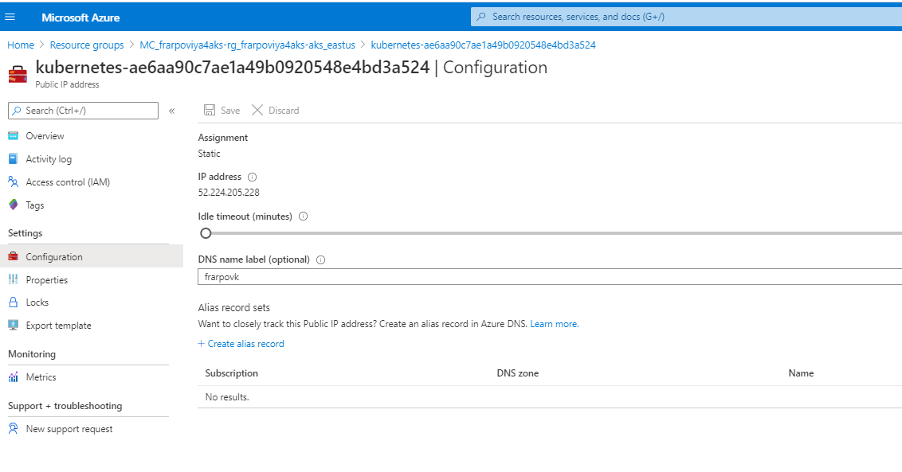

# Performing Pre-reqs in AKS

* [What do we need?](#what-do-we-need)
* [Create the project folder](#create-the-project-folder)
* [Install the NGINX ingress controller](#install-the-nginx-ingress-controller)
* [Define a DNS entry in Azure for the public IP](#define-a-dns-entry-in-azure-for-the-public-ip)
  * [Automated method to define a DNS entry in Azure for public IP](#automated-method-to-define-a-dns-entry-in-azure-for-public-ip)
  * [Manual Method (using the Azure Portal)](#manual-method-using-the-azure-portal)
* [Configure and check Kustomize](#configure-and-check-kustomize)
* [Create the namespace](#create-the-namespace)
* [Deploy GELLDAP in our namespace](#deploy-gelldap-in-our-namespace)
* [Update default storage class to support statefulset on multiple AZ](#update-default-storage-class-to-support-statefulset-on-multiple-az)
* [Create New StorageClass to support RWX](#create-new-storageclass-to-support-rwx)
* [Copy the OKViya script](#copy-the-okviya-script)
* [Install yq](#install-yq)
* [Install cert-manager](#install-cert-manager)
* [Install Metrics server (for HPA)](#install-metrics-server-for-hpa)
* [References](#references)
* [Navigation](#navigation)

## What do we need?

Before being in position to deploy Viya on AKS, there are a few things that we need :

* Install Kustomize (in the Cloud Shell environment)
* a Viya Order (Deployment Assets)
* An Ingress controller
* An LDAP Server

There are also "nice to have" stuff such as the OKViya4 tool to monitor services startup, mirror manager (in cas  we'd like to setup our own registry), the Ops4Viya toolbox for monitoring and alerting, etc...

## Create the project folder

```bash
# create the project folder
mkdir -p ~/clouddrive/project/deploy/lab
```

## Install the NGINX ingress controller

We will install the NGINX ingress controller by simply applying their manifests in our AKS cluster.
The manifest files are named ```mandatory.yaml``` and ```cloud-generic.yaml``` and are stored in our payload directory.

* You can open and review them to get an idea of what they do (the kind of Kubernetes objects that they create, the access level that is needed, etc...):

  ```sh
  cat ~/clouddrive/payload/nginx/mandatory.yaml
  cat ~/clouddrive/payload/nginx/cloud-generic.yaml
  ```

* Let's copy them in our project folder:

  ```bash
  # copy Ingress deployment manifests from the payload
  cp ~/clouddrive/payload/nginx/mandatory.yaml ~/clouddrive/project/deploy/lab
  cp ~/clouddrive/payload/nginx/cloud-generic.yaml ~/clouddrive/project/deploy/lab
  ```

  The second manifest (cloud-generic.yaml) will create a Kubernetes Service with a type "LoadBalancer" which will trigger the creation of an external load-balancer in Azure.

  But before doing so, we need to configure it to allow access only from the SAS network and from our own Cloud Shell machine (unless you'd like to receive an "Azure Security Violation" email from Joshua Walton :) ).

* We want to insert in the NGNIX Ingress service definition several IP ranges to allow Access from Cary, Marlow subnets and also from the other nodes and from our own Azure Shell IP). We use ansible to do that.

  ```bash
  # use ansible to update the Ingress deployment with authorized IP ranges
  CSIP=$(curl ifconfig.me)/32
  cat > /tmp/insertAuthorizeIPs.yml << EOF
  ---
  - hosts: localhost
    tasks:
    - name: Insert Auth IP block in ingress definition
      blockinfile:
        path: ~/clouddrive/project/deploy/lab/cloud-generic.yaml
        insertafter: "spec:"
        block: |2
            loadBalancerSourceRanges:
            - 10.244.0.0/16 #Pod CIDR
            - 109.232.56.224/27 #Marlow
            - 149.173.0.0/16 #Cary
            - $CSIP #CloudShell
  EOF
  ## apply
  ansible-playbook /tmp/insertAuthorizeIPs.yml --diff
  #remove ansible marker lines otherwhise it does not work the next time
  ansible localhost -m lineinfile -a "dest=~/clouddrive/project/deploy/lab/cloud-generic.yaml state='absent' line='# BEGIN ANSIBLE MANAGED BLOCK'"
  ansible localhost -m lineinfile -a "dest=~/clouddrive/project/deploy/lab/cloud-generic.yaml state='absent' line='# END ANSIBLE MANAGED BLOCK'"
  ```

* Look at the result :

  ```bash
  # check the Ingress deployment manifest with authorized IPs
  cat ~/clouddrive/project/deploy/lab/cloud-generic.yaml
  ```

* OK, now we can apply the NGINX ingress controller manifests :

  ```bash
  # Deploy and configure the Ingress controller (ngnix)
  kubectl apply -f ~/clouddrive/project/deploy/lab/mandatory.yaml
  kubectl apply -f ~/clouddrive/project/deploy/lab/cloud-generic.yaml
  ```

* After you deployed nginx, you can run :

  ```sh
  kubectl get svc -n ingress-nginx
  ```

  and you'll get the external IP of the Load Balancer for that IP.
  You can even store it into an environment variable.

  ```sh
  LBIP=$(kubectl get service -n ingress-nginx | grep LoadBalancer | awk '{print $4}')
  ```

  It is a useful information and you will see that we use it later.

  It corresponds to the public IP assigned to the AKS cluster which is also visible in the Azure portal (go the "MC_" resource group that corresponds to your own cluster and you will see a new Public IP address resource starting with "kubernetes").

  

  The public IP allows the access to our Viya 4 applications from the outside.

## Define a DNS entry in Azure for the public IP

### Automated method to define a DNS entry in Azure for public IP

Let's use the Azure CLI to associate the DNS to the newly created Public IP address.

* First we need to get the LB Public IP id (as defined in the Azure Cloud).

  <!--
  ```bash
  # before creating the DNS alias, we need to let some time for azure to create the public IP after we applied the ingress manifest
  sleep 30
  ```
  -->

  ```bash
  STUDENT=$(cat ~/student.txt)
  # get the LB Public IP id (as defined in the Azure Cloud)
  PublicIPId=$(az network lb show -g MC_${STUDENT}viya4aks-rg_${STUDENT}viya4aks-aks_eastus -n kubernetes --query "frontendIpConfigurations[].publicIpAddress.id" --out table |grep kubernetes)
  echo $PublicIPId
  ```

  <!-- some az query examples
  PublicIPId=$(az network lb show -g MC_${STUDENT}viya4aks-rg_${STUDENT}viya4aks-aks_eastus -n kubernetes --query "frontendIpConfigurations[].publicIpAddress.id" --out tsv)
  PublicIPId=$(az network lb show -g MC_${STUDENT}viya4aks-rg_${STUDENT}viya4aks-aks_eastus -n kubernetes --query "frontendIpConfigurations[].publicIpAddress.id" --out table |grep kubernetes | awk -F "/" '{print $(NF)}')
  -->

* Now,  we use the Public IP Id to create and associate a DNS alias:

  ```bash
  #use the Id to associate a DNS alias
  az network public-ip update -g MC_${STUDENT}viya4aks-rg_${STUDENT}viya4aks-aks_eastus \
  --ids $PublicIPId --dns-name ${STUDENT}vk
  ```

### Manual Method (using the Azure Portal)

Open the Azure portal and navigate to the "MC_" resource group created behind the scene for your AKS cluster.


Then click on the Public IP address item for kubernetes (the name of the Public IP starts with "kubernetes"), select "Configuration" and type a DNS label as below.
Please use your SAS ID and concatenate it with "vk" (for Viya Kubernetes)



## Configure and check Kustomize

* Run the command below to add Kustomize in the PATH for the current bash session.

  ```bash
  # Configure and check Kustomize
  export PATH=$PATH:$HOME/clouddrive/payload/kustomize
  kustomize version
  ```

* Now let's save the modified path for the next time.

  ```bash
  ansible localhost \
      -m lineinfile \
      -a "dest=~/.bashrc \
          line='export PATH=$PATH:$SHOME/clouddrive/payload/kustomize' \
          state=present" \
      --diff
  ```

## Create the namespace

* Create a namespace for our lab environment

    ```sh
    kubectl create ns lab
    kubectl get ns
    ```

<!-- cheat code
    ```bash
    # create a namespace for our lab environment
    kubectl delete ns lab
    kubectl create ns lab
    ```
-->

<!-- Note
  # ansible localhost -m k8s "name=lab kind=namespace state=present api_version=v1" --diff
  # sadly the openshift module is not available for ansible in Cloud Shell and we don't have the permission to install it in the Cloud Shell environment.
  # /opt/ansible/bin/python -m pip install openshift
-->

* Make it the default namespace:

    ```bash
    kubectl config set-context --current --namespace=lab
    ```

## Deploy GELLDAP in our namespace

* Let's copy the gelldap artifacts from the payload directory:

    ```bash
    # copy gelldap deployment artifcats
    cp -R ~/clouddrive/payload/gelldap ~/clouddrive/project/
    ```

* Deploy GELLDAP into the namespace

    ```bash
    # Deploy GELLDAP into the lab namespace
    cd ~/clouddrive/project/gelldap/
    kustomize build ./no_TLS/ | kubectl -n lab apply -f -
    ```

* To confirm that the pod is running:

    ```bash
    #confirm that the gelldap pod is running
    kubectl -n lab get all,cm -l app.kubernetes.io/part-of=gelldap
    ```

## Update default storage class to support statefulset on multiple AZ

When creating AKS cluster with nodes/(node pools) in multiple AZs, there is a need to create a storage class with the plugin - 'WaitForFirstConsumer'.
Currently Dynamic Volumes for Viya pods - consul, rabbit & cacheserver, are created with 'VolumeBindingMode' set to 'Immediate' with default(AzureDisk) Storage.

Reference : https://gitlab.sas.com/CloudOps4Viya/k8s-quickstarts-tf/azure-aks-4-viya/-/issues/13

* Run the code below to update the default storage class, (it has to be done before deploying Viya):

    ```bash
    cat << 'EOF' > ~/clouddrive/project/deploy/lab/DefaultStorageClassUpdate.yaml
    ## Reference: https://kubernetes.io/docs/concepts/storage/storage-classes/#volume-binding-mode
    kind: StorageClass
    apiVersion: storage.k8s.io/v1
    allowVolumeExpansion: true
    metadata:
      annotations:
        storageclass.beta.kubernetes.io/is-default-class: "true"
      labels:
        kubernetes.io/cluster-service: "true"
      name: default
    provisioner: kubernetes.io/azure-disk
    parameters:
      storageaccounttype: Standard_LRS
      kind: managed
    volumeBindingMode: WaitForFirstConsumer
    ## TODO: if needed
    ## allowedTopologies:
    ## - matchLabelExpressions:
    ##   - key: failure-domain.beta.kubernetes.io/zone
    ##     values:
    ##     - us-east2-a
    ##     - us-east2-b
    EOF

    # now let's apply the manifest
    kubectl delete sc default
    kubectl apply -f ~/clouddrive/project/deploy/lab/DefaultStorageClassUpdate.yaml
    # verify default sc is updated
    kubectl get sc default
    ```

## Create New StorageClass to support RWX

We know from the [Viya4-azure XENO project](https://gitlab.sas.com/xeno/viya4-azure/-/blob/master/1-kubernetes-cluster.md) that using a custom Storage Class for a deployment in Azure is required:

"_NOTE: Azure defines azurefile and azurefile-premium by default now, however, the default sc definitions have 2 undocumented and seemingly problematic options mfsymlinks and cache=strict;
The default uid and gid values don't match the 'sas' user's either, both of which things have been known to cause problems as per COMPUTESVCS-1290._

_Unfortunately, we don't currently appear to be able to replace the azurefile definition with our own settings as documented in <https://github.com/Azure/AKS/issues/118#issuecomment-640558185>
and so we are defining a new "sc" with our own custom name. The jury is out on whether we should be using the nfs-provisioner instead._"

* Let's create our custom storage class.

  ```bash
  #Create custom StorageClass to support RWX
  cd ~/clouddrive/project/deploy/lab
  cat << 'EOF' > StorageClass-RWX.yaml
  kind: StorageClass
  apiVersion: storage.k8s.io/v1
  metadata:
    name: sas-azurefile
  provisioner: kubernetes.io/azure-file
  mountOptions:
    - dir_mode=0777
    - file_mode=0777
    - uid=1001
    - gid=1001
  parameters:
    skuName: Standard_LRS
  allowVolumeExpansion: true
  EOF
  ```

* Now let's apply the manifest

    ```bash
    # Create the storage class
    kubectl apply -f StorageClass-RWX.yaml
    ```

## Copy the OKViya script

* The OKViya script is a very handy tool to manage the Viya 4 applications (get status, start, stop), let's get him from the payload tarball.

    ```bash
    # Copy the OKViya script from the payload
    cp ~/clouddrive/payload/gel_OKViya4/gel_OKViya4.sh* ~/clouddrive/project/deploy/lab
    ```

## Install yq

* **yq** is a very handy tool to manipulate yaml files. Let's install it.

    ```bash
    VERSION=3.4.0
    BINARY=yq_linux_386
    wget https://github.com/mikefarah/yq/releases/download/${VERSION}/${BINARY} -O $HOME/bin/yq &&\
        chmod +x $HOME/bin/yq
    $HOME/bin/yq --version
    ```

## Install cert-manager

* We install cert-manager in its own namespace

    ```bash
    # not idempotent, to recreate, you'll need to delete the cert-manager crds
    kubectl create namespace cert-manager
    helm repo add jetstack https://charts.jetstack.io
    helm repo update
    helm install cert-manager jetstack/cert-manager \
        --namespace cert-manager \
        --version v1.0.3  \
        --set installCRDs=true \
        --set extraArgs='{--enable-certificate-owner-ref=true}'
    ```

_Note : we need it to configure front door TLS and also to deploy the Viya logging tool (Kibana) with TLS._


## Install Metrics server (for HPA)

* Install the K8s metrics server

    ```sh
    kubectl apply -f https://github.com/kubernetes-sigs/metrics-server/releases/download/v0.3.6/components.yaml
    ```

## References

<https://rndconfluence.sas.com/confluence/display/RNDDEVOPS/Azure+How+To+Articles>

## Navigation

<!-- startnav -->
* [01 Introduction / 01 031 Booking a Lab Environment for the Workshop](/01_Introduction/01_031_Booking_a_Lab_Environment_for_the_Workshop.md)
* [01 Introduction / 01 032 Assess Readiness of Lab Environment](/01_Introduction/01_032_Assess_Readiness_of_Lab_Environment.md)
* [02 Kubernetes and Containers Fundamentals / 02 131 Learning about Namespaces](/02_Kubernetes_and_Containers_Fundamentals/02_131_Learning_about_Namespaces.md)
* [03 Viya 4 Software Specifics / 03 011 Looking at a Viya 4 environment with Visual Tools DEMO](/03_Viya_4_Software_Specifics/03_011_Looking_at_a_Viya_4_environment_with_Visual_Tools_DEMO.md)
* [03 Viya 4 Software Specifics / 03 031 Create your own Viya order](/03_Viya_4_Software_Specifics/03_031_Create_your_own_Viya_order.md)
* [04 Pre Requisites / 04 061 Pre Requisites automation with ARKCD](/04_Pre-Requisites/04_061_Pre-Requisites_automation_with_ARKCD.md)
* [05 Deployment tools / 05 121 Setup a Windows Client Machine](/05_Deployment_tools/05_121_Setup_a_Windows_Client_Machine.md)
* [06 Deployment Steps / 06 031 Deploying a simple environment](/06_Deployment_Steps/06_031_Deploying_a_simple_environment.md)
* [06 Deployment Steps / 06 051 Deploying Viya with Authentication](/06_Deployment_Steps/06_051_Deploying_Viya_with_Authentication.md)
* [06 Deployment Steps / 06 061 Deploying in a second namespace](/06_Deployment_Steps/06_061_Deploying_in_a_second_namespace.md)
* [06 Deployment Steps / 06 071 Removing Viya deployments](/06_Deployment_Steps/06_071_Removing_Viya_deployments.md)
* [06 Deployment Steps / 06 215 Deploying a programing only environment](/06_Deployment_Steps/06_215_Deploying_a_programing-only_environment.md)
* [07 Deployment Customizations / 07 051 Adding a local registry to k8s](/07_Deployment_Customizations/07_051_Adding_a_local_registry_to_k8s.md)
* [07 Deployment Customizations / 07 052 Using mirrormgr to populate the local registry](/07_Deployment_Customizations/07_052_Using_mirrormgr_to_populate_the_local_registry.md)
* [07 Deployment Customizations / 07 053 Deploy from local registry](/07_Deployment_Customizations/07_053_Deploy_from_local_registry.md)
* [11 Azure AKS Deployment / 11 011 Creating an AKS Cluster](/11_Azure_AKS_Deployment/11_011_Creating_an_AKS_Cluster.md)
* [11 Azure AKS Deployment / 11 012 Performing Prereqs in AKS](/11_Azure_AKS_Deployment/11_012_Performing_Prereqs_in_AKS.md)**<-- you are here**
* [11 Azure AKS Deployment / 11 013 Deploying Viya 4 on AKS](/11_Azure_AKS_Deployment/11_013_Deploying_Viya_4_on_AKS.md)
* [11 Azure AKS Deployment / 11 014 Deleting the AKS Cluster](/11_Azure_AKS_Deployment/11_014_Deleting_the_AKS_Cluster.md)
* [11 Azure AKS Deployment / 11 015 Fast track with cheatcodes](/11_Azure_AKS_Deployment/11_015_Fast_track_with_cheatcodes.md)
* [11 Azure AKS Deployment / 11 131 CAS Customizations](/11_Azure_AKS_Deployment/11_131_CAS_Customizations.md)
* [11 Azure AKS Deployment / 11 132 Install monitoring and logging](/11_Azure_AKS_Deployment/11_132_Install_monitoring_and_logging.md)
<!-- endnav -->
