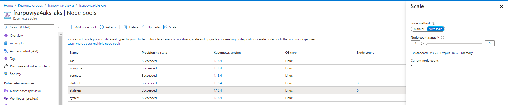

# Deploy Viya 4 in AKS

* [Prepare the Order's Deployment Assets](#prepare-the-orders-deployment-assets)
* [Create a site-config directory](#create-a-site-config-directory)
* [Creating a sitedefault file](#creating-a-sitedefault-file)
* [Creating a TLS-related file in `./site-config/`](#creating-a-tls-related-file-in-site-config)
* [How to configure the external PostgreSQL for a customer ? (optionnal)](#how-to-configure-the-external-postgresql-for-a-customer--optionnal)
  * [Create secretGenerator and configMapGenerator](#create-secretgenerator-and-configmapgenerator)
  * [Configure Transformers](#configure-transformers)
* [Deploy Viya in our AKS cluster](#deploy-viya-in-our-aks-cluster)
  * [Kustomize the LAB deployment](#kustomize-the-lab-deployment)
  * [Configure CAS MPP](#configure-cas-mpp)
  * [Build step](#build-step)
  * [Deployment : Apply the Kubernetes manifests](#deployment--apply-the-kubernetes-manifests)
* [Monitor the Viya services startup](#monitor-the-viya-services-startup)
  * [Monitor with OKViya](#monitor-with-okviya)
    * [Add NSG rule for Cloud Shell IP access](#add-nsg-rule-for-cloud-shell-ip-access)
    * [Watching the environment come up](#watching-the-environment-come-up)
  * [Monitor the cluster with lens](#monitor-the-cluster-with-lens)
* [Validation](#validation)
  * [Connect to your Viya applications](#connect-to-your-viya-applications)
  * [Make sure you are on the Cary Network](#make-sure-you-are-on-the-cary-network)
* [Optionnal : Configure Azure autoscaling to 0 nodes](#optionnal--configure-azure-autoscaling-to-0-nodes)
* [Remove the Viya Deployment](#remove-the-viya-deployment)
  * [Stop the pods](#stop-the-pods)
  * [Delete the namespace](#delete-the-namespace)
* [Optionnal : Deploy and start a second Viya Environment](#optionnal--deploy-and-start-a-second-viya-environment)
  * [Create the namespace for dev](#create-the-namespace-for-dev)
  * [Use the non-default name for the external postgresDB](#use-the-non-default-name-for-the-external-postgresdb)
  * [Prepare another kustomize file for dev](#prepare-another-kustomize-file-for-dev)
  * [Watch the cluster autoscaling](#watch-the-cluster-autoscaling)
  * [Deploy the DEV Viya environment](#deploy-the-dev-viya-environment)
  * [Check the new Nodes](#check-the-new-nodes)
  * [Check the new PostgreSQL Database](#check-the-new-postgresql-database)
  * [Expose the second name space on Internet](#expose-the-second-name-space-on-internet)
  * [Delete the namespace dev](#delete-the-namespace-dev)
* [Troubleshooting](#troubleshooting)
  * [Issues with rabbitMQ (affects 2020.0.4)](#issues-with-rabbitmq-affects-202004)
* [Navigation](#navigation)

## Prepare the Order's Deployment Assets

Several Order's Deployment assets are available in our payload directory (they were collected from : <https://gelweb.race.sas.com/scripts/PSGEL255/orders/>)

For more details on these orders and their content, consult [this page](01_Introduction/01_999_OrdersIndex.md)

* Run the code below to extract the Order's deployment assets from the payload tarball and make them available for our deployment.

    ```bash
    # Set the order and copy the deployment assets from the payload archive in deploy lab dir
    # ORDER=9CFD7L
    ORDER=9CDZDD
    CADENCE_VERSION="2020\.0\.6"
    ORDER_FILE=$(ls -t ~/clouddrive/payload/orders | grep ${ORDER} | grep ${CADENCE_VERSION} | head -n 1)
    echo $ORDER_FILE
    cp ~/clouddrive/payload/orders/${ORDER_FILE} ~/clouddrive/project/deploy/lab
    cd ~/clouddrive/project/deploy/lab
    rm -Rf sas-bases
    tar xvf $ORDER_FILE && rm $ORDER_FILE
    ```

## Create a site-config directory

* We need to create a "site-config" to store our specific configuration (it is a separated space from the Software provided manifests).

    ```bash
    mkdir -p ~/clouddrive/project/deploy/lab/site-config/
    cd ~/clouddrive/project/deploy/lab
    ```

## Creating a sitedefault file

* Since we installed GELLDAP we can pre-configure the LDAP access.
* Let's copy the provided file in the proper location:

    ```bash
    # Copy the gelldap site-default
    cp ~/clouddrive/project/gelldap/no_TLS/gelldap-sitedefault.yaml ~/clouddrive/project/deploy/lab/site-config/
    ```

<!-- * Generate a sitedefault.yaml just to define the default password for the sasboot account

    ```sh
    tee  ~/clouddrive/project/deploy/lab/site-config/sitedefault.yaml > /dev/null << "EOF"
    ---
    config:
      application:
        sas.logon.initial:
          user: sasboot
          password: lnxsas
    EOF
    ```
-->

## Creating a TLS-related file in `./site-config/`

By default since the 2020.0.6 version, all internal communications are TLS encrypted.

* Prepare the TLS configuration

    ```bash
    cd ~/clouddrive/project/deploy/lab
    mkdir -p ./site-config/security/
    # create the certificate issuer called "sas-viya-issuer"
    sed 's|{{.*}}|sas-viya-issuer|g' ./sas-bases/examples/security/cert-manager-provided-ingress-certificate.yaml  \
        > ./site-config/security/cert-manager-provided-ingress-certificate.yaml
    ```

## How to configure the external PostgreSQL for a customer ? (optionnal)

The recommended way to do that is to go to the ```$deploy/sas-bases/overlays/external—postgres directory``` and follow the instructions in the README file.

You can also see an example of a completed base kustomization.yaml  file for an external PostgreSQL instance, you can look at
```$deploy/sas-bases/examples/configure-postgres/external-kustomization.yaml```.

_Note: In our lab, $deploy corresponds to ```~/clouddrive/project/deploy/lab```_.

If you want to try to do this configuration by yourself (like in a real customer environment) you can follow the instructions below that come from the README file, to configure your kustomization.yaml file for an external Postgres Database (you will also have to add the custom storage class patch as explained in the next section).

Otherwhise, if you want to deploy Viya with the pre-canned configuration that we have for you, then just follow the steps in the next [section](#deploy-viya-in-our-aks-cluster).

### Create secretGenerator and configMapGenerator

To populate the SAS deployment with the information that you gathered in the "Prerequisites" section, you must add some generators to the base kustomization.yaml file.

In the base kustomization.yaml file (`$deploy/kustomization.yaml`), add a secretGenerator and a configMapGenerator, both of which are described below.

In the generators, you will see tags that look like `{{ VARIABLE-NAME }}` corresponding to the PostgresSQL Database Service attributes (remembre that the Azure PostgresSQL Database Service was previously create by the Terraform templates).
Replace these tags with the appropriate values gathered in the "Prerequisites" section.

The mapping of tags to values is as follows:

* Database Role Username: `{{ EXTERNAL-ADMIN-USERNAME }}`
* Database Role Password: `{{ EXTERNAL-ADMIN-PASSWORD }}`
* Server Host: `{{ EXTERNAL-HOST }}`
* Server Port: `{{ EXTERNAL-PORT }}`

* Add the following secretGenerator to the base kustomization.yaml file:

    ```yaml
    secretGenerator:
    - name: postgres-sas-user  # THIS IS FOR INTERNAL USE ONLY - DO NOT EDIT
      literals:
      - username={{ EXTERNAL-ADMIN-USERNAME }}
      - password={{ EXTERNAL-ADMIN-PASSWORD }}
    ```

* Then add the following configMapGenerator:

    ```yaml
    configMapGenerator:
    - name: sas-postgres-config  # THIS IS FOR INTERNAL USE ONLY - DO NOT EDIT
      behavior: merge
      literals:
      - DATABASE_HOST={{ EXTERNAL-HOST }}
      - DATABASE_PORT={{ EXTERNAL-PORT }}
      - DATABASE_SSL_ENABLED="true"
      - DATABASE_NAME=SharedServices  # THIS IS FOR INTERNAL USE ONLY - DO NOT EDIT
      - EXTERNAL_DATABASE="true"  # THIS IS FOR INTERNAL USE ONLY - DO NOT EDIT
      - SAS_DATABASE_DATABASESERVERNAME="postgres"
      - SPRING_DATASOURCE_URL=jdbc:postgresql://{{ EXTERNAL-HOST }}:{{ EXTERNAL-PORT }}/SharedServices?currentSchema=${application.schema}
    ```

### Configure Transformers

Kustomize needs to know where to look for the external PostgreSQL transformer.

* Add the following content to the transformers block of the base kustomization.yaml file:

    ```yaml
    transformers:
    - sas-bases/overlays/external-postgres/external-postgres-transformer.yaml
    ```

<!-- Finally here is an example with the Azure provide PostgreSQL database : <https://gitlab.sas.com/xeno/viya4-azure/-/blob/master/kustomization.yaml> -->

## Deploy Viya in our AKS cluster

### Kustomize the LAB deployment

In this step we edit the kustomization.yaml file in order to generate Kubernetes manifests that are :

* Using a custom Storage Class to support RWX access for components that needs it (CAS, backup manager, etc...)
* Using an external Azure postgres in our Lab environment.

* First, let's create the patch that we will refer to for the storage class.

    ```bash
    mkdir -p ~/clouddrive/project/deploy/lab/site-config/patches
    cat > ~/clouddrive/project/deploy/lab/site-config/patches/storage-class.yaml <<-EOF
    kind: PersistentStorageClass
    metadata:
      name: wildcard
    spec:
      storageClassName: sas-azurefile #local-nfs
    EOF
    ```

* Then create the kustomization.yaml file with the external postgres DB configuration and the reference to the storage class path.

    ```bash
    STUDENT=$(cat ~/student.txt)
    echo $STUDENT
    INGRESS_SUFFIX=${STUDENT}vk.eastus.cloudapp.azure.com
    cat > ~/clouddrive/project/deploy/lab/kustomization.yaml <<-EOF
    ---
    namespace: lab
    resources:
      - sas-bases/base
      - sas-bases/overlays/cert-manager-issuer     # TLS
      - sas-bases/overlays/network/ingress
      - sas-bases/overlays/network/ingress/security   # TLS
    #  - sas-bases/overlays/internal-postgres
    #  - sas-bases/overlays/crunchydata
      - sas-bases/overlays/cas-server
      - sas-bases/overlays/update-checker       # added update checker
      - sas-bases/overlays/cas-server/auto-resources    # CAS-related
    configurations:
      - sas-bases/overlays/required/kustomizeconfig.yaml  # required for 0.6
    transformers:
      - sas-bases/overlays/network/ingress/security/transformers/product-tls-transformers.yaml   # TLS
      - sas-bases/overlays/network/ingress/security/transformers/ingress-tls-transformers.yaml   # TLS
      - sas-bases/overlays/network/ingress/security/transformers/backend-tls-transformers.yaml   # TLS
      - sas-bases/overlays/required/transformers.yaml
    #  - sas-bases/overlays/internal-postgres/internal-postgres-transformer.yaml
      - sas-bases/overlays/external-postgres/external-postgres-transformer.yaml
      - site-config/security/cert-manager-provided-ingress-certificate.yaml     # TLS
      - sas-bases/overlays/cas-server/auto-resources/remove-resources.yaml    # CAS-related
      # - sas-bases/overlays/scaling/zero-scale/phase-0-transformer.yaml
      # - sas-bases/overlays/scaling/zero-scale/phase-1-transformer.yaml
    # set a custom Storage Class for PersistentVolumeClaims, as it's not currently possible to change the default SC in AKS
    # a new SC is required to support ReadWriteMany access
    # Note: annotationSelector is how we limit which PV use azurefiles/RWX versus default RWO.
    patches:
    - path: site-config/patches/storage-class.yaml
      target:
        kind: PersistentVolumeClaim
        annotationSelector: sas.com/component-name in (sas-cas-operator,sas-backup-job,sas-event-stream-processing-studio-app,sas-reference-data-deploy-utilities,sas-data-quality-services,sas-model-publish)

    configMapGenerator:
      - name: ingress-input
        behavior: merge
        literals:
          - INGRESS_HOST=${INGRESS_SUFFIX}

      - name: sas-shared-config
        behavior: merge
        literals:
          - SAS_SERVICES_URL=https://${INGRESS_SUFFIX}

      - name: sas-consul-config            ## This injects content into consul. You can add, but not replace
        behavior: merge
        files:
          - SITEDEFAULT_CONF=site-config/gelldap-sitedefault.yaml

      - name: sas-postgres-config
        behavior: merge
        literals:
          - DATABASE_HOST=${STUDENT}viya4aks-pgsql.postgres.database.azure.com
          - DATABASE_PORT=5432
          - DATABASE_SSL_ENABLED="false"
          - DATABASE_NAME=SharedServices
          - EXTERNAL_DATABASE="true"
          - SAS_DATABASE_DATABASESERVERNAME="postgres"
          - SPRING_DATASOURCE_URL=jdbc:postgresql://${STUDENT}viya4aks-pgsql.postgres.database.azure.com:5432/SharedServices?currentSchema=\${application.schema}

    secretGenerator:
      - name: postgres-sas-user
        literals:
          - username=pgadmin@${STUDENT}viya4aks-pgsql
          - password=LNX_sas_123
    EOF
    ```

After you revise the base kustomization.yaml file, continue your SAS Viya deployment as documented

### Configure CAS MPP

* By default CAS is installed with SMP
* Run the commands below to configure CAS with 3 workers.

    ```bash
    # Copy the PatchTransformer from the examples
    cp -p ~/clouddrive/project/deploy/lab/sas-bases/examples/cas/configure/cas-manage-workers.yaml ~/clouddrive/project/deploy/lab/site-config/cas-manage-workers.yaml

    # Set the required number of workers
    _numberOfWorkers=3

    # Modify the project site-config/cas-manage-workers.yaml file with the required number of workers
    sed -i "s/{{ NUMBER-OF-WORKERS }}/${_numberOfWorkers}/g" ~/clouddrive/project/deploy/lab/site-config/cas-manage-workers.yaml

    # Add a new transformer
    printf "
    - command: update
      path: transformers[+]
      value:
        site-config/cas-manage-workers.yaml
    " | $HOME/bin/yq -I 4 w -i -s - ~/clouddrive/project/deploy/lab/kustomization.yaml
    ```

### Build step

* At this point, we are ready to generate or populate the Kubernetes manifest files with Kustomize.

    ```bash
    cd ~/clouddrive/project/deploy/lab
    kustomize build -o site.yaml
    ```

### Deployment : Apply the Kubernetes manifests

* We are now ready to apply the manifests in our AKS cluster to deploy and start the Viya 4 containers:

  There are 3 level of admin in the resources defined in the site.yaml :
  * "cluster-wide" (operators/crds, service accounts, roles)
  * "cluster-local" (rolebindings, pvc, config map, secrets, podtemplates)
  * "namespace" (the rest of the resources)

  Each resource has a label for it, the key is "sas.com/admin" and the value is one of the 3 levels
  (You can search for "sas.com/admin: <administration scope level>" keyword in the site.yaml to see the corresponding resources)

  To show that a different K8s permission level is required depending on the type of resources created, we will use 3 distinct commands for the deployment.

    ```bash
    cd ~/clouddrive/project/deploy/lab
    # Apply the "cluster wide" configuration in site.yaml (CRDs, Roles, Service Accounts)
    kubectl apply --selector="sas.com/admin=cluster-wide" -f site.yaml
    # Wait for Custom Resource Deployment to be deployed
    kubectl wait --for condition=established --timeout=60s -l "sas.com/admin=cluster-wide" crd
    ```

    The previous commands requires a cluster level access (cluster-admin role) and create "cluster wide" resources (that do not ony applies to a namespace but to the cluster in general : such as operators, roles and service accounts)

    The next command required a cluster-local permission.

    ```bash
    #Apply the "cluster local" configuration in site.yaml and delete all the other "cluster local" resources that are not in the file (essentially config maps)
    kubectl apply --selector="sas.com/admin=cluster-local" -f site.yaml --prune
    ```

    Finally the next command can be run by a namespace admin.

    ```bash
    # Apply the configuration in manifest.yaml that matches label "sas.com/admin=namespace" and delete all the other resources that are not in the file and match label "sas.com/admin=namespace".
    kubectl apply --selector="sas.com/admin=namespace" -f site.yaml --prune
    ```

    Doing this will create all required content in kubernetes and start up the process.

* For the next time we want to start the Viya 4 containers, you can simply reapply the site.yaml file with the command below (since the components created outside of the namespace scope will already be there)

    ```sh
    cd ~/clouddrive/project/deploy/lab
    kubectl -n lab apply -f site.yaml
    ```

## Monitor the Viya services startup

### Monitor with OKViya

#### Add NSG rule for Cloud Shell IP access

* To allow the gel_OKViya4.sh script to check the urls health we need to allow our Cloud Shell environment to access.

  ```bash
  CSIP=$(curl ifconfig.me)
  LBIP=$(kubectl get service -n ingress-nginx | grep LoadBalancer | awk '{print $4}')
  az network nsg rule create -g ${STUDENT}viya4aks-rg --nsg-name ${STUDENT}viya4aks-nsg -n AllowPort80In --priority 220 \
  --source-address-prefixes ${CSIP} --source-port-ranges '*' \
  --destination-address-prefixes ${LBIP} --destination-port-ranges '80' --access Allow \
  --protocol Tcp --description "Port_80_okviya"
  ```

* If you had a disconnection from the Azure Shell since you performed the pre-requisite steps, your Azure Shell container will likely have a new IP address and will not be allowed in the LoadBalancer Source range. In such case the gel_OKViya4.sh script will return only yellow boxes :)

* So just to be sure, we refresh the ingress loadBalancerSourceRanges so it has the current IP address of the cloud shell.

    ```bash
    # use ansible to update the Ingress deployment with authorized IP ranges
    CSIP=$(curl ifconfig.me)/32
    cat > /tmp/insertAuthorizeIPs.yml << EOF
    ---
    - hosts: localhost
      tasks:
      - name: Insert Auth IP block in ingress definition
        blockinfile:
          path: ~/clouddrive/project/deploy/lab/cloud-generic.yaml
          insertafter: "loadBalancerSourceRanges:"
          block: |2
              - 10.244.0.0/16 #Pod CIDR
              - 109.232.56.224/27 #Marlow
              - 149.173.0.0/16 #Cary
              - $CSIP #CloudShell
    EOF
    ## apply
    ansible-playbook /tmp/insertAuthorizeIPs.yml --diff
    kubectl apply -f ~/clouddrive/project/deploy/lab/cloud-generic.yaml
    #remove ansible marker lines otherwhise it does not work the next time
    ansible localhost -m lineinfile -a "dest=~/clouddrive/project/deploy/lab/cloud-generic.yaml state='absent' line='# BEGIN ANSIBLE MANAGED BLOCK'"
    ansible localhost -m lineinfile -a "dest=~/clouddrive/project/deploy/lab/cloud-generic.yaml state='absent' line='# END ANSIBLE MANAGED BLOCK'"
    ```

#### Watching the environment come up

* With the `gel_OKViya4.sh` script:

    ```bash
    cd ~/clouddrive/project/deploy/lab
    ./gel_OKViya4.sh -n lab --wait -ps
    ```

* If you prefer to see the tested URL (showing the curl command with the ingress host), you can type :

    ```sh
    cd ~/clouddrive/project/deploy/lab
    ./gel_OKViya4.sh -n lab --wait -ps -co lines
    ```

* At the end you should see something like :

  

* You can also use tmux to have a multi-windows monitoring:

1. This will kick off a tmux session called "lab_watch":

      ```sh
      #watch kubectl get pods -o wide -n lab

      SessName=lab_watch

      tmux new -s $SessName -d
      tmux send-keys -t $SessName "time ~/clouddrive/project/deploy/lab/gel_OKViya4.sh -n lab --wait --pod-status"  C-m
      tmux split-window -v -t $SessName
      tmux send-keys -t $SessName "watch 'kubectl get pods -o wide -n lab | grep 0/ | grep -v Completed '"  C-m

      ```

1. And this will attach you to it:

    ```sh
    tmux attach -t $SessName
    ```

### Monitor the cluster with lens

* What is [Lens](https://github.com/lensapp/lens/) ?

  * Lens is a great IDE to take control of your Kubernetes cluster.
  * It is a standalone application for MacOS, Windows and Linux operating systems.
  * It is open source and free.

* In the Lens github project, click on "Releases", then download and install Lens on your machine.

* Get your Cluster config file

In the Azure Cloud Shell, click on the "Open Editor" icon

Then browse in the Files view to display the content of .kube/config file


Copy the content of the config file.

Open Lens, click on "Add cluster" for "Choose config", select "Custom"


and paste the content of the config file.
Click on "Add Cluster" and then you should see something that looks like that :


You can see the nodes, pods, configuration, logs etc... very easily. You can also start a Terminal from there to run kubectl commands against your Cluster.

A successful deployment would look like that in Lens:


## Validation

### Connect to your Viya applications

* Run the command below to get the url printed in the Cloud Shell terminal, then you can just click on it (with the CTRL key).

    ```bash
    echo "https://${STUDENT}vk.eastus.cloudapp.azure.com/"
    ```

If the SAS Logon page appears, then connect as ```sastest1``` or ```sasadm``` (password is "lnxsas"). Otherwhise look at the next section.

### Make sure you are on the Cary Network

* If you see something like that when you try to open the url :

  

  It is likely that your workstation has an IP that is not in the authorized IP range to access the environment.

  By default in the ingress definition, we allowed the Cary Headquarter IP range. So the best way to get an IP in this range from your own workstation is to be on the Cary Direct VPN (profile 3 usually).

## Optionnal : Configure Azure autoscaling to 0 nodes

* To reduce the costs we would like to set the min_count for our SAS Viya Nodepools to 0. So when you stop the Viya environment, the nodes should disappear after a a little while, saving significant costs.

* The easiest way would have been to set it in the Terraform variables. However a bug is preventing the min_count/node_count to be set to zero in TF: <https://github.com/terraform-providers/terraform-provider-azurerm/pull/8300>.

* In addition portal does not allow you to it. So we use the az CLI to do it.

  ```sh
  az aks nodepool update --update-cluster-autoscaler --min-count 0 --max-count 5 -g ${STUDENT}viya4aks-rg -n stateless --cluster-name ${STUDENT}viya4aks-aks
  #az aks nodepool update --update-cluster-autoscaler --min-count 0 --max-count 5 -g ${STUDENT}viya4aks-rg -n compute --cluster-name ${STUDENT}viya4aks-aks
  az aks nodepool update --update-cluster-autoscaler --min-count 0 --max-count 5 -g ${STUDENT}viya4aks-rg -n cas --cluster-name ${STUDENT}viya4aks-aks
  az aks nodepool update --update-cluster-autoscaler --min-count 0 --max-count 5 -g ${STUDENT}viya4aks-rg -n connect --cluster-name ${STUDENT}viya4aks-aks
  ```

_Note: until further testing we keep at least one node for the stateful pods._

## Remove the Viya Deployment

### Stop the pods

* Stop all the "running" pods for good, you would have to run:

    ```sh
    kubectl -n lab scale deployments --all --replicas=0
    kubectl -n lab scale statefulsets --all --replicas=0
    kubectl -n lab delete casdeployment --all
    kubectl -n lab delete jobs --all
    ```

* Note that if we want to restart at this point you can run :

    ```sh
    cd ~/clouddrive/project/deploy/lab
    kubectl -n lab apply -f site.yaml
    ```

  But because we've done a scale to zero, and because the number of replicas is not part of the manifest, we also have to do a scale to 1 !

    ```sh
    kubectl -n lab scale deployments --all --replicas=1
    kubectl -n lab scale statefulsets --all --replicas=1
    ```

### Delete the namespace

* To get rid of the environment delete the whole namespace.

    ```sh
    kubectl delete ns lab
    ```

## Optionnal : Deploy and start a second Viya Environment

Thanks to the concept of isolated Kubernetes namespaces, it is very easy to deploy another Viya environment in the same AKS cluster.
As we will see the only real challenge is on the Ingress controller.

Let's see how to deploy another Viya Environment in the "dev" namespace.

### Create the namespace for dev

* Run the command below to create a new namespace called "dev"

    ```sh
    kubectl create ns dev
    ```

### Use the non-default name for the external postgresDB

Reference : <https://rndconfluence.sas.com/confluence/display/RNDDEVOPS/Multiple+Namespace+Deployment+with+Single+External+PG>

* We want to use the sme external PG server to host both environment SAS Data Server infrastructure. The default database name is 'SharedServices'.

* In order to create multiple databases on a single external PG server, we need to use different database name per each deployment.

* For now, we need to update/add 3 parts in kustomization.yaml : sas-shared-config, sas-postgres-config and sas-go-config

### Prepare another kustomize file for dev

* We need to use the new namespace name, the new ingress and adjust the sas-shared-config, sas-postgres-config and sas-go-config parts to allow the new deployment to utilize a different PG Database (from the one already created and use for the lab deployment). The PG database used for the "dev" namespace will be named "SharedServicesDEV".

    ```sh
    mkdir ~/clouddrive/project/deploy/dev
    cd ~/clouddrive/project/deploy/dev

    INGRESS_SUFFIX=dev.eastus.cloudapp.azure.com
    cat > ~/clouddrive/project/deploy/dev/kustomization.yaml <<-EOF
    ---
    namespace: dev
    resources:
      - ../lab

    configMapGenerator:
      - name: ingress-input
        behavior: merge
        literals:
          - INGRESS_HOST=${INGRESS_SUFFIX}


      - name: sas-shared-config
        behavior: merge
        literals:
          - SAS_SERVICES_URL=http://${INGRESS_SUFFIX}
          - SAS_DATABASE_DATABASE=SharedServicesDEV

      - name: sas-postgres-config
        behavior: merge
        literals:
          - DATABASE_HOST=${STUDENT}viya4aks-pgsql.postgres.database.azure.com
          - DATABASE_PORT=5432
          - DATABASE_SSL_ENABLED="false"
          - DATABASE_NAME=SharedServicesDEV
          - EXTERNAL_DATABASE="true"
          - SAS_DATABASE_DATABASESERVERNAME="postgres"
          - SPRING_DATASOURCE_URL=jdbc:postgresql://${STUDENT}viya4aks-pgsql.postgres.database.azure.com:5432/SharedServices?currentSchema=\${application.schema}

      - name: sas-go-config
        behavior: merge
        literals:
        - SAS_DATABASE_DATABASE=SharedServicesDEV
    EOF
    cd ~/clouddrive/project/deploy/dev
    # Build the DEV manifests
    kustomize build -o site.yaml
    ```

Caveat is that if you change "lab", those changes will also apply to "dev" if you re-build and re-apply the manifests for it.

### Watch the cluster autoscaling

You might have not noticed it yet but we configured our Terraform template in a way that our AKS cluster is using quite small VMs (all our instance type comes with only 4 vcpu). Also we start with only one VM per Node pool (1 VM for CAS, 1 for stateless, 1 for stateful, etc...).
Of course it will not be enough to have a running Viya 4 environment. But the AKS cluster will automatically scale out to accomoadate the pod requests.

When we start the deployment we have only 6 VMs (one by node pool), but at the end additional nodes have been automatically provisionned to match the pods workload requests thanks to the Azure auto-scaler.

The benefit of that is that as long as we don't start the Viya environment, the cost remains limited also when we stop viya (by scaling down to 0 all our pods), then the AKS cluster will adjust the infrastructure by scaling down the number of Azure VMs to match with the Kubernetes cluster workload current request (without loosing the user content thanks to the Persistent Volumes).

Now before deploying a secondary Viya environment, let's see how many nodes we have for now


### Deploy the DEV Viya environment

* Now let's deploy another Viya in the new namespace.

    ```sh
    cd ~/clouddrive/project/deploy/dev
    kubectl apply -f site.yaml -n dev
    ```

While the pods are starting in the "dev" namespace, you can monitor the pods and watch the number of nodes in Lens.


* You can also running this command in your Azure Cloud Shell:

    ```sh
    watch "kubectl get nodes -o wide"
    ```

### Check the new Nodes

After a little while, you will see the new nodes that have been automatically provisioned by Azure.


You can also see that in the Azure Portal. Click on the "Kubernetes service" resource into your own "Resource Group" (<STUDENT>viya4aks-rg), then on the left menu, select "Scale".


Click on the first line link that sends you to the node pools page. From there you can see the current number of nodes in each pool.



You can see that the maximum number of stateless nodes is set to 5. It means a total of 5x16 GB of RAM, it is likely not enough to run two Viya environment. See if you can increase this number and notice the impact on the Pods in Lens.

### Check the new PostgreSQL Database

Open the Azure portal and click on the "Azure Database for PostgreSQL Server" resource into your own "Resource Group" (<STUDENT>viya4aks-rg), you should see that a new Database called "SharedServicesDEV" has been created.


### Expose the second name space on Internet

In a customer environment, you would have to make the second name space available to the outside world, using the Ingress controller.
To do that we need to have different URL prefixs that could be used to redirect the user queries toward the proper namespace, such as lab.sasgelsandbox.
However, in the Azure confifuration we can only assign ONE DNS name for the Public IP that was created to access our AKS cluster.

It is outside of the scope of this hands-on, but to serve multiple namespaces deployments from the outside we could either buy our own Domain (from a domain registrar) and use Azure DNS alias records or use the names.sas.com (as explained [there](https://rndconfluence.sas.com/confluence/display/RNDDEVOPS/Multiple+Namespace+Deployment+with+Single+External+PG) and adjust our INGRESS_SUFFIX accordingly in the kustomization.yaml).

Real life customers will likely have their own domains and be in position to request named or wildcard DNS aliases t support as many Viya environments as they want in the same AKS cluster.

<!-- There are a few solutions. But it is outside of our current scope.

#### Create another DNS alias for the new namespace

* We use the same IP address but we need to use another DNS that we will configure in kustomize, so the ingress controller will know it must send the request to the new namespace services.

  ```sh
  az network dns record-set cname set-record --resource-group ${STUDENT}viya4aks-rg --zone-name contoso.com --record-set-name test-cname --cname www.contoso.com
  ``` -->

### Delete the namespace dev

* Run this command to get rid of all the resources in the dev namespace

    ```sh
    kubectl delete ns dev
    ```

With lens, you should see very quickly that the pods are not running any longer.


In addition, after 10 minutes, the number of nodes, should also drop.

## Troubleshooting

### Issues with rabbitMQ (affects 2020.0.4)

If you restart then the env does not come up bc of RabbitMQ "mnesia" database issues.

* You can scale rabbit to 0, delete the rabbit PVCs, then scale back to 3. I hope to have this patch promoted later today or tomorrow.

    ```sh
    kubectl delete pvc sas-viya-rabbitmq-data-volume-sas-rabbitmq-server-0
    kubectl delete pvc sas-viya-rabbitmq-data-volume-sas-rabbitmq-server-1
    kubectl delete pvc sas-viya-rabbitmq-data-volume-sas-rabbitmq-server-2
    ```

from <https://rndjira.sas.com/browse/NGMTS-15211>

## Navigation

<!-- startnav -->
* [01 Introduction / 01 031 Booking a Lab Environment for the Workshop](/01_Introduction/01_031_Booking_a_Lab_Environment_for_the_Workshop.md)
* [01 Introduction / 01 032 Assess Readiness of Lab Environment](/01_Introduction/01_032_Assess_Readiness_of_Lab_Environment.md)
* [02 Kubernetes and Containers Fundamentals / 02 131 Learning about Namespaces](/02_Kubernetes_and_Containers_Fundamentals/02_131_Learning_about_Namespaces.md)
* [03 Viya 4 Software Specifics / 03 011 Looking at a Viya 4 environment with Visual Tools DEMO](/03_Viya_4_Software_Specifics/03_011_Looking_at_a_Viya_4_environment_with_Visual_Tools_DEMO.md)
* [03 Viya 4 Software Specifics / 03 031 Create your own Viya order](/03_Viya_4_Software_Specifics/03_031_Create_your_own_Viya_order.md)
* [04 Pre Requisites / 04 061 Pre Requisites automation with ARKCD](/04_Pre-Requisites/04_061_Pre-Requisites_automation_with_ARKCD.md)
* [05 Deployment tools / 05 121 Setup a Windows Client Machine](/05_Deployment_tools/05_121_Setup_a_Windows_Client_Machine.md)
* [06 Deployment Steps / 06 031 Deploying a simple environment](/06_Deployment_Steps/06_031_Deploying_a_simple_environment.md)
* [06 Deployment Steps / 06 051 Deploying Viya with Authentication](/06_Deployment_Steps/06_051_Deploying_Viya_with_Authentication.md)
* [06 Deployment Steps / 06 061 Deploying in a second namespace](/06_Deployment_Steps/06_061_Deploying_in_a_second_namespace.md)
* [06 Deployment Steps / 06 071 Removing Viya deployments](/06_Deployment_Steps/06_071_Removing_Viya_deployments.md)
* [06 Deployment Steps / 06 215 Deploying a programing only environment](/06_Deployment_Steps/06_215_Deploying_a_programing-only_environment.md)
* [07 Deployment Customizations / 07 051 Adding a local registry to k8s](/07_Deployment_Customizations/07_051_Adding_a_local_registry_to_k8s.md)
* [07 Deployment Customizations / 07 052 Using mirrormgr to populate the local registry](/07_Deployment_Customizations/07_052_Using_mirrormgr_to_populate_the_local_registry.md)
* [07 Deployment Customizations / 07 053 Deploy from local registry](/07_Deployment_Customizations/07_053_Deploy_from_local_registry.md)
* [11 Azure AKS Deployment / 11 011 Creating an AKS Cluster](/11_Azure_AKS_Deployment/11_011_Creating_an_AKS_Cluster.md)
* [11 Azure AKS Deployment / 11 012 Performing Prereqs in AKS](/11_Azure_AKS_Deployment/11_012_Performing_Prereqs_in_AKS.md)
* [11 Azure AKS Deployment / 11 013 Deploying Viya 4 on AKS](/11_Azure_AKS_Deployment/11_013_Deploying_Viya_4_on_AKS.md)**<-- you are here**
* [11 Azure AKS Deployment / 11 014 Deleting the AKS Cluster](/11_Azure_AKS_Deployment/11_014_Deleting_the_AKS_Cluster.md)
* [11 Azure AKS Deployment / 11 015 Fast track with cheatcodes](/11_Azure_AKS_Deployment/11_015_Fast_track_with_cheatcodes.md)
* [11 Azure AKS Deployment / 11 131 CAS Customizations](/11_Azure_AKS_Deployment/11_131_CAS_Customizations.md)
* [11 Azure AKS Deployment / 11 132 Install monitoring and logging](/11_Azure_AKS_Deployment/11_132_Install_monitoring_and_logging.md)
<!-- endnav -->
