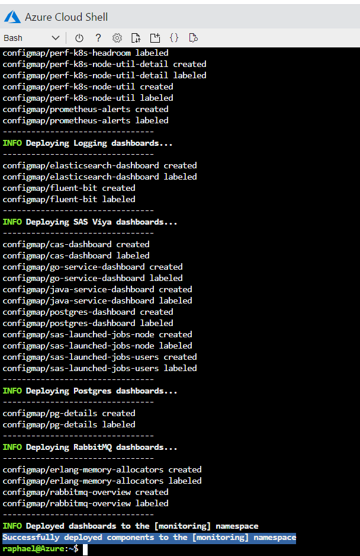
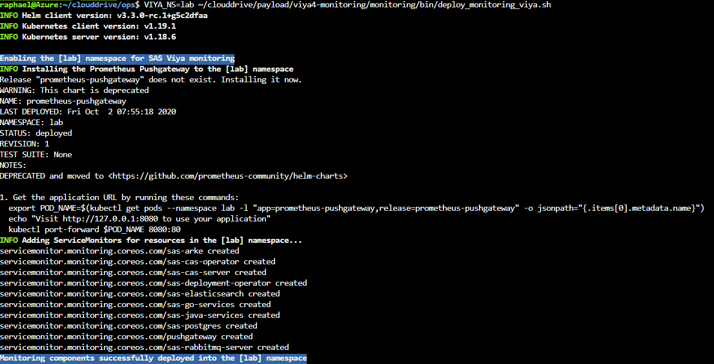
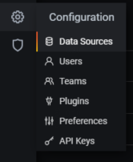
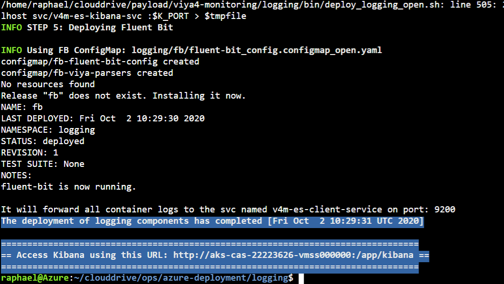
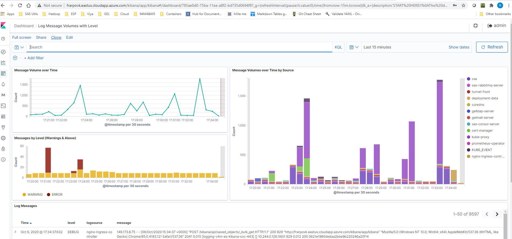

# Deploy SAS Viya Monitoring for Kubernetes

* [Introduction](#introduction)
* [Deploy Monitoring tools](#deploy-monitoring-tools)
* [Optional : remove the monitoring tools](#optional--remove-the-monitoring-tools)
* [Deploy Logging tools](#deploy-logging-tools)
  * [Optional : remove the logging tools](#optional--remove-the-logging-tools)
* [Navigation](#navigation)

## Introduction

In this hands-on, we want to leverage the [SAS Viya Monitoring for Kubernetes](https://github.com/sassoftware/viya4-monitoring-kubernetes) scripts and customization options to deploy monitoring, alerts, and log aggregation for SAS Viya 4.x.

The monitoring solution is based on opensource tools such as [Prometheus](https://prometheus.io/docs/introduction/overview/), [Grafana](https://grafana.com/) and [Alert Manager](https://prometheus.io/docs/alerting/latest/alertmanager/).

The logging solution is also based on opensource tools and includes the EFK stack ([Elasticsearch](https://www.elastic.co/elasticsearch/), [Fluent Bit](https://fluentbit.io/) and [Kibana](https://www.elastic.co/kibana)).

Monitoring and logging may be deployed independently or together. There are no hard dependencies between the two.

Note that, instead, in the Azure Cloud you could rely on the integrated **Azure Monitoring services** and especially with the AKS add-ons. If you want to know more about it and even try it by yourself visit this [page](https://gitlab.sas.com/GEL/workshops/PSGEL260-sas-viya-4.0.1-administration/-/blob/master/04_observability/01_10_azure_enable_monitoring.md) from the GEL Administration VLE.

## Deploy Monitoring tools

* Create a dir for the monitoring tools

    ```bash
    # create dir for monitoring
    mkdir -p ~/clouddrive/ops/azure-deployment/monitoring
    ```

* Copy the azure samples

    ```bash
    # copy azure samples
    cp -R ~/clouddrive/payload/viya4-monitoring/samples/azure-deployment/monitoring ~/clouddrive/ops/azure-deployment
    export USER_DIR=~/clouddrive/ops/azure-deployment
    ```

* Copy the user.env sample

    ```bash
    # copy user.env
    cp ~/clouddrive/payload/viya4-monitoring/monitoring/user.env ~/clouddrive/ops/azure-deployment/monitoring
    ```

* Then edit ```$USER_DIR/monitoring/user-values-prom-operator.yaml``` to replace host.cluster.example.com with ingress host

* Either manually

    ```sh
    code $USER_DIR/monitoring/user-values-prom-operator.yaml
    ```

* Or automatically

    ```yaml
    cat > ~/clouddrive/ops/azure-deployment/monitoring/user-values-prom-operator.yaml << EOF
    kubelet:
        serviceMonitor:
            # Azure uses http for kubelet metrics by default
            # See issue: https://github.com/coreos/prometheus-operator/issues/926
            https: true

    prometheus:
        service:
            type: ClusterIP
            nodePort: null
        ingress:
            enabled: true
            annotations:
                kubernetes.io/ingress.class: nginx
            hosts:
            - ${STUDENT}vk.eastus.cloudapp.azure.com
            paths:
            - /prometheus
        prometheusSpec:
            routePrefix: /prometheus
            externalUrl: http://${STUDENT}vk.eastus.cloudapp.azure.com/prometheus

    alertmanager:
        service:
            type: ClusterIP
            nodePort: null
        ingress:
            enabled: true
            annotations:
                kubernetes.io/ingress.class: nginx
            hosts:
            - ${STUDENT}vk.eastus.cloudapp.azure.com
            paths:
            - /alertmanager
        alertmanagerSpec:
            routePrefix: /alertmanager
            externalUrl: http://${STUDENT}vk.eastus.cloudapp.azure.com/alertmanager

    grafana:
        "grafana.ini":
            server:
                protocol: http
                domain: ${STUDENT}vk.eastus.cloudapp.azure.com
                root_url: http://${STUDENT}vk.eastus.cloudapp.azure.com/grafana
                serve_from_sub_path: true
        service:
            type: ClusterIP
            nodePort: null
        ingress:
            enabled: true
            hosts:
            - ${STUDENT}vk.eastus.cloudapp.azure.com
            path: /grafana
        testFramework:
            enabled: false
    EOF
    ```

<!-- for cheatcodes as we kept the yaml formating insted of bash
    ```bash
    # configure user-values-prom-operator
    cat > ~/clouddrive/ops/azure-deployment/monitoring/user-values-prom-operator.yaml << EOF
    kubelet:
        serviceMonitor:
            # Azure uses http for kubelet metrics by default
            # See issue: https://github.com/coreos/prometheus-operator/issues/926
            https: true

    prometheus:
        service:
            type: ClusterIP
            nodePort: null
        ingress:
            enabled: true
            annotations:
                kubernetes.io/ingress.class: nginx
            hosts:
            - ${STUDENT}vk.eastus.cloudapp.azure.com
            paths:
            - /prometheus
        prometheusSpec:
            routePrefix: /prometheus
            externalUrl: http://${STUDENT}vk.eastus.cloudapp.azure.com/prometheus

    alertmanager:
        service:
            type: ClusterIP
            nodePort: null
        ingress:
            enabled: true
            annotations:
                kubernetes.io/ingress.class: nginx
            hosts:
            - ${STUDENT}vk.eastus.cloudapp.azure.com
            paths:
            - /alertmanager
        alertmanagerSpec:
            routePrefix: /alertmanager
            externalUrl: http://${STUDENT}vk.eastus.cloudapp.azure.com/alertmanager

    grafana:
        "grafana.ini":
            server:
                protocol: http
                domain: ${STUDENT}vk.eastus.cloudapp.azure.com
                root_url: http://${STUDENT}vk.eastus.cloudapp.azure.com/grafana
                serve_from_sub_path: true
        service:
            type: ClusterIP
            nodePort: null
        ingress:
            enabled: true
            hosts:
            - ${STUDENT}vk.eastus.cloudapp.azure.com
            path: /grafana
        testFramework:
            enabled: false
    EOF
    ```
-->

* Deploy the monitoring tool

    ```bash
    export USER_DIR=~/clouddrive/ops/azure-deployment
    ~/clouddrive/payload/viya4-monitoring/monitoring/bin/deploy_monitoring_cluster.sh
    ```

* If you see something like in the screenshot below, it means that the monitoring project was successfully deployed in the cluster.

    

* Temporary fix to allow the push gateway to start in our Viya namespace

    ```bash
    export USER_DIR=~/clouddrive/ops/azure-deployment
    cp ~/clouddrive/payload/viya4-monitoring/monitoring/user-values-pushgateway.yaml $USER_DIR/monitoring
    echo "tolerations:" > $USER_DIR/monitoring/user-values-pushgateway.yaml
    echo "  - effect: NoSchedule" >> $USER_DIR/monitoring/user-values-pushgateway.yaml
    echo "    key: workload.sas.com/class" >> $USER_DIR/monitoring/user-values-pushgateway.yaml
    echo "    value: stateful" >> $USER_DIR/monitoring/user-values-pushgateway.yaml
    ```

* Now, lets deploy the Viya monitoring

    ```bash
    VIYA_NS=lab ~/clouddrive/payload/viya4-monitoring/monitoring/bin/deploy_monitoring_viya.sh
    ```

* If you see something like in the screenshot below, it means that the monitoring project was successfully deployed in our viya namespace.

    

* Expose kube-proxy Metrics ([source](https://github.com/sassoftware/viya4-monitoring-kubernetes/tree/master/monitoring))

    Some clusters are deployed with the kube-proxy metrics listen address set to 127.0.0.1, which prevents Prometheus from collecting metrics. To enable kube-proxy metrics, which are used in the Kubernetes / Proxy dashboard, run this command:

    ```bash
    # Change metricsBindAddress to 0.0.0.0:10249
    kubectl create configmap kube-proxy --from-literal=metricsBindAddress=0.0.0.0:10249 -n kube-system
    # Restart all kube-proxy pods
    kubectl delete po -n kube-system -l component=kube-proxy
    # Pods will automatically be recreated
    ```

* Validate : run the code below and click on the links

    ```bash
    echo "open grafana : https://${STUDENT}vk.eastus.cloudapp.azure.com/grafana"
    echo "open prometheus : https://${STUDENT}vk.eastus.cloudapp.azure.com/prometheus"
    echo "open alertmanager : https://${STUDENT}vk.eastus.cloudapp.azure.com/alertmanager"
    ```

<!-- * Connect grafana to prometheus

  * Open Grafana and update the database configuration, so it can find the prometheus database

    

  * Update the url so it corresponds to the prometheus URL -->

## Optional : remove the monitoring tools

* remove the monitoring infrastructure

    ```sh
    # Optional: Remove SAS Viya monitoring
    # Run this section once per Viya namespaceIYA_NS=lab
    ~/clouddrive/payload/viya4-monitoring/monitoring/bin/remove_monitoring_viya.sh
    # Remove cluster monitoring
    monitoring/bin/remove_monitoring_cluster.sh
    ```

Removing cluster monitoring does not remove persistent volume claims by default. A re-install after removal should retain existing data. Manually delete the PVCs or the namespace to delete previously collected monitoring data.

## Deploy Logging tools

* Create a dir for the logging tools

    ```bash
    mkdir -p ~/clouddrive/ops/azure-deployment/logging
    ```

* Copy the azure sample

    ```bash
    cp -R ~/clouddrive/payload/viya4-monitoring/samples/azure-deployment/logging ~/clouddrive/ops/azure-deployment
    export USER_DIR=~/clouddrive/ops/azure-deployment
    ```

* Copy the user.env sample

    ```bash
    cp ~/clouddrive/payload/viya4-monitoring/logging/user.env ~/clouddrive/ops/azure-deployment/logging
    ```

* Add the 3 lines below in the logging/user.env file (because the script uses uuidgen which is not installed in the Azure shell)

    ```log
    ES_KIBANASERVER_PASSWD="lnxsas"
    ES_LOGCOLLECTOR_PASSWD="lnxsas"
    ES_METRICGETTER_PASSWD="lnxsas"
    ```

* You can also do it by running the block of commands below

    ```bash
    echo "ES_KIBANASERVER_PASSWD=\"lnxsas\"" > ~/clouddrive/ops/azure-deployment/logging/user.env
    echo "ES_LOGCOLLECTOR_PASSWD=\"lnxsas\"" >> ~/clouddrive/ops/azure-deployment/logging/user.env
    echo "ES_METRICGETTER_PASSWD=\"lnxsas\"" >> ~/clouddrive/ops/azure-deployment/logging/user.env
    ```

* Then edit ```$USER_DIR/logging/user-values-elasticsearch-open.yaml``` to replace host.cluster.example.com with ingress host

* Either manually

    ```sh
    code $USER_DIR/logging/user-values-elasticsearch-open.yaml
    ```

* Or automatically

    ```yaml
    cat > ~/clouddrive/ops/azure-deployment/logging/user-values-elasticsearch-open.yaml << EOF
    kibana:
        extraEnvs:
        # Needed for path-based ingress
        - name: SERVER_BASEPATH
          value: /kibana
        # Username & password need to be set here since helm replaces array values
        - name: ELASTICSEARCH_USERNAME
          value: admin
        - name: ELASTICSEARCH_PASSWORD
          value: admin

        service:
            type: ClusterIP
            nodePort: null

        ingress:
            annotations:
                kubernetes.io/ingress.class: nginx
                nginx.ingress.kubernetes.io/affinity: "cookie"
                nginx.ingress.kubernetes.io/ssl-redirect: "false"
                nginx.ingress.kubernetes.io/configuration-snippet: |
                    rewrite (?i)/kibana/(.*) /\$1 break;
                    rewrite (?i)/kibana$ / break;
                nginx.ingress.kubernetes.io/rewrite-target: /kibana
            enabled: true
            hosts:
            - ${STUDENT}vk.eastus.cloudapp.azure.com/kibana
    EOF
    ```

<!-- for cheatcodes as we kept the yaml formating insted of bash
    ```bash
    cat > ~/clouddrive/ops/azure-deployment/logging/user-values-elasticsearch-open.yaml << EOF
    kibana:
        extraEnvs:
        # Needed for path-based ingress
        - name: SERVER_BASEPATH
          value: /kibana
        # Username & password need to be set here since helm replaces array values
        - name: ELASTICSEARCH_USERNAME
          value: admin
        - name: ELASTICSEARCH_PASSWORD
          value: admin

        service:
            type: ClusterIP
            nodePort: null

        ingress:
            annotations:
                kubernetes.io/ingress.class: nginx
                nginx.ingress.kubernetes.io/affinity: "cookie"
                nginx.ingress.kubernetes.io/ssl-redirect: "false"
                nginx.ingress.kubernetes.io/configuration-snippet: |
                    rewrite (?i)/kibana/(.*) /\$1 break;
                    rewrite (?i)/kibana$ / break;
                nginx.ingress.kubernetes.io/rewrite-target: /kibana
            enabled: true
            hosts:
            - ${STUDENT}vk.eastus.cloudapp.azure.com/kibana
    EOF
    ```
-->

* Deploy the logging tool

    ```bash
    export USER_DIR=~/clouddrive/ops/azure-deployment
    ~/clouddrive/payload/viya4-monitoring/logging/bin/deploy_logging_open.sh
    ```

* At the end you should see something like:

  

* Validate : run the code below and click on the links

    ```bash
    echo "open http://${STUDENT}vk.eastus.cloudapp.azure.com/kibana/"
    ```

* Check the log dashboards, you should be able to view something like :

    

### Optional : remove the logging tools

* Remove Kibana

    ```sh
    # uninstall logging
    export USER_DIR=~/clouddrive/ops/azure-deployment
    ~/clouddrive/payload/viya4-monitoring/logging/bin/remove_logging_open.sh
    #then delete namespace
    kubectl delete ns logging
    ```

## Navigation

<!-- startnav -->
* [01 Introduction / 01 031 Booking a Lab Environment for the Workshop](/01_Introduction/01_031_Booking_a_Lab_Environment_for_the_Workshop.md)
* [01 Introduction / 01 032 Assess Readiness of Lab Environment](/01_Introduction/01_032_Assess_Readiness_of_Lab_Environment.md)
* [02 Kubernetes and Containers Fundamentals / 02 131 Learning about Namespaces](/02_Kubernetes_and_Containers_Fundamentals/02_131_Learning_about_Namespaces.md)
* [03 Viya 4 Software Specifics / 03 011 Looking at a Viya 4 environment with Visual Tools DEMO](/03_Viya_4_Software_Specifics/03_011_Looking_at_a_Viya_4_environment_with_Visual_Tools_DEMO.md)
* [03 Viya 4 Software Specifics / 03 031 Create your own Viya order](/03_Viya_4_Software_Specifics/03_031_Create_your_own_Viya_order.md)
* [04 Pre Requisites / 04 061 Pre Requisites automation with ARKCD](/04_Pre-Requisites/04_061_Pre-Requisites_automation_with_ARKCD.md)
* [05 Deployment tools / 05 121 Setup a Windows Client Machine](/05_Deployment_tools/05_121_Setup_a_Windows_Client_Machine.md)
* [06 Deployment Steps / 06 031 Deploying a simple environment](/06_Deployment_Steps/06_031_Deploying_a_simple_environment.md)
* [06 Deployment Steps / 06 051 Deploying Viya with Authentication](/06_Deployment_Steps/06_051_Deploying_Viya_with_Authentication.md)
* [06 Deployment Steps / 06 061 Deploying in a second namespace](/06_Deployment_Steps/06_061_Deploying_in_a_second_namespace.md)
* [06 Deployment Steps / 06 071 Removing Viya deployments](/06_Deployment_Steps/06_071_Removing_Viya_deployments.md)
* [06 Deployment Steps / 06 215 Deploying a programing only environment](/06_Deployment_Steps/06_215_Deploying_a_programing-only_environment.md)
* [07 Deployment Customizations / 07 051 Adding a local registry to k8s](/07_Deployment_Customizations/07_051_Adding_a_local_registry_to_k8s.md)
* [07 Deployment Customizations / 07 052 Using mirrormgr to populate the local registry](/07_Deployment_Customizations/07_052_Using_mirrormgr_to_populate_the_local_registry.md)
* [07 Deployment Customizations / 07 053 Deploy from local registry](/07_Deployment_Customizations/07_053_Deploy_from_local_registry.md)
* [11 Azure AKS Deployment / 11 011 Creating an AKS Cluster](/11_Azure_AKS_Deployment/11_011_Creating_an_AKS_Cluster.md)
* [11 Azure AKS Deployment / 11 012 Performing Prereqs in AKS](/11_Azure_AKS_Deployment/11_012_Performing_Prereqs_in_AKS.md)
* [11 Azure AKS Deployment / 11 013 Deploying Viya 4 on AKS](/11_Azure_AKS_Deployment/11_013_Deploying_Viya_4_on_AKS.md)
* [11 Azure AKS Deployment / 11 014 Deleting the AKS Cluster](/11_Azure_AKS_Deployment/11_014_Deleting_the_AKS_Cluster.md)
* [11 Azure AKS Deployment / 11 015 Fast track with cheatcodes](/11_Azure_AKS_Deployment/11_015_Fast_track_with_cheatcodes.md)
* [11 Azure AKS Deployment / 11 131 CAS Customizations](/11_Azure_AKS_Deployment/11_131_CAS_Customizations.md)
* [11 Azure AKS Deployment / 11 132 Install monitoring and logging](/11_Azure_AKS_Deployment/11_132_Install_monitoring_and_logging.md)**<-- you are here**
<!-- endnav -->
