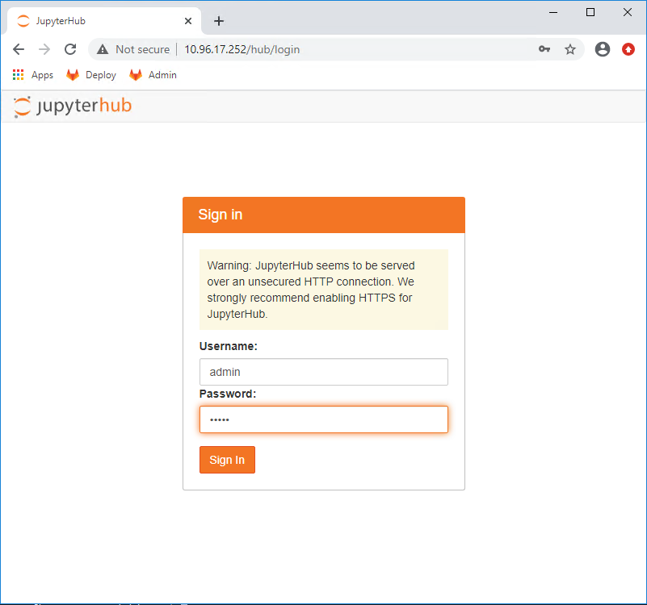
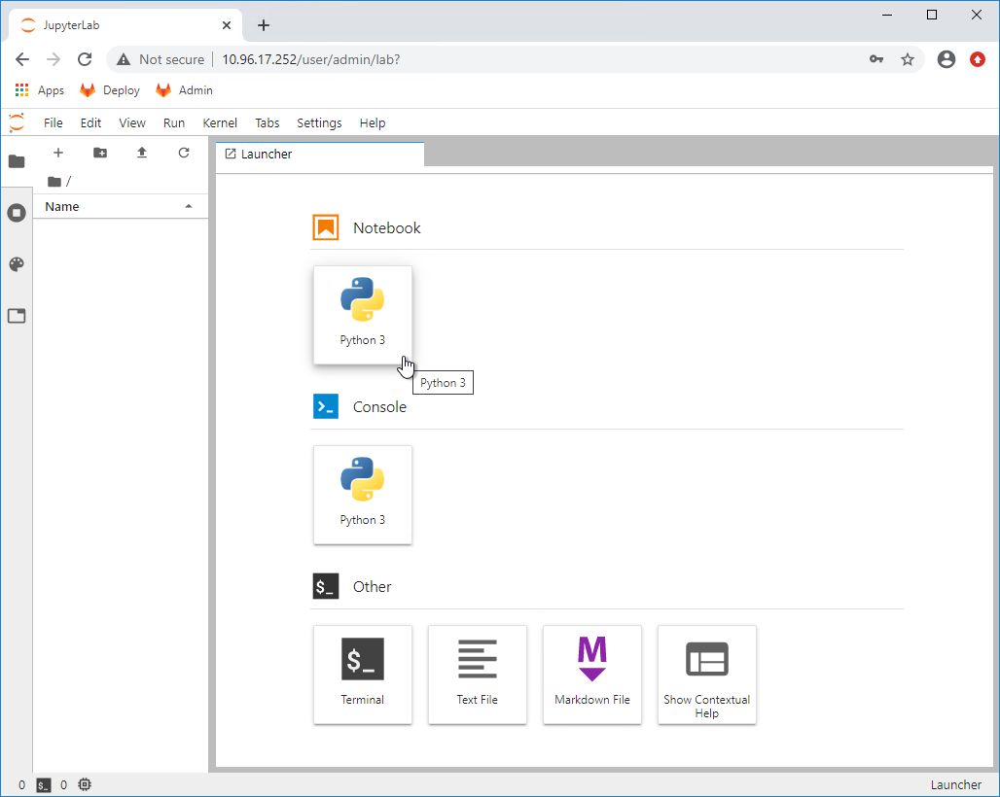
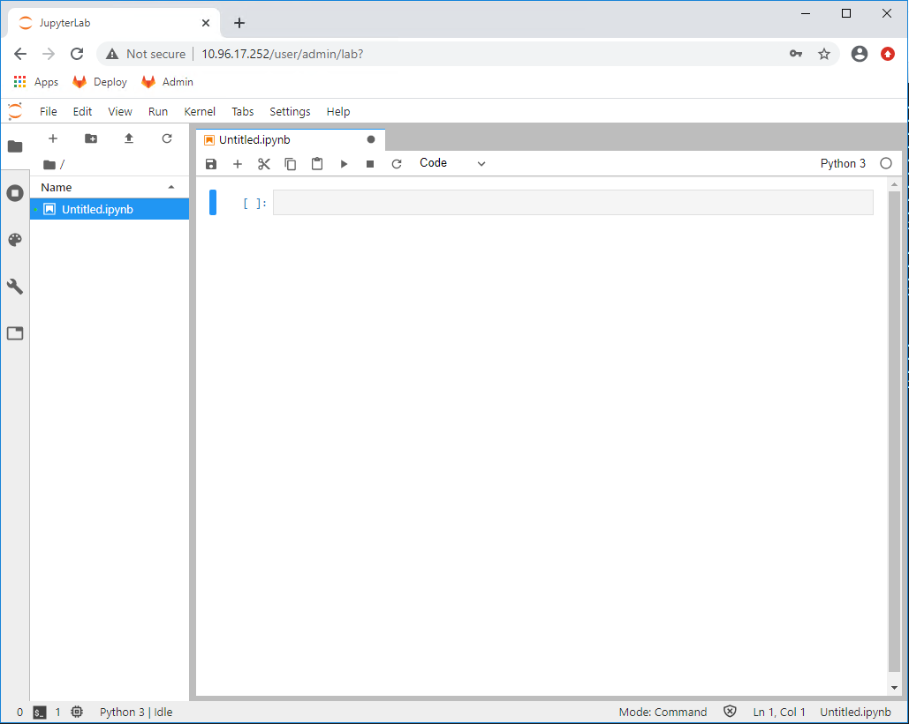
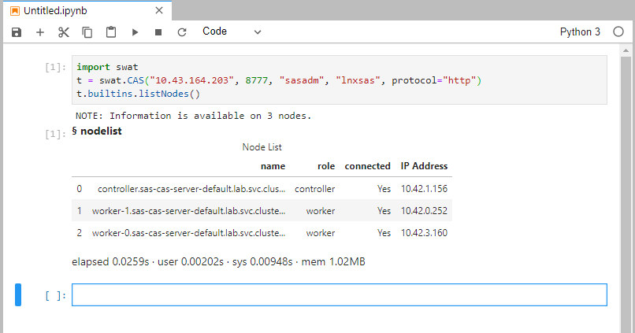
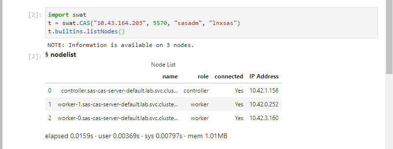
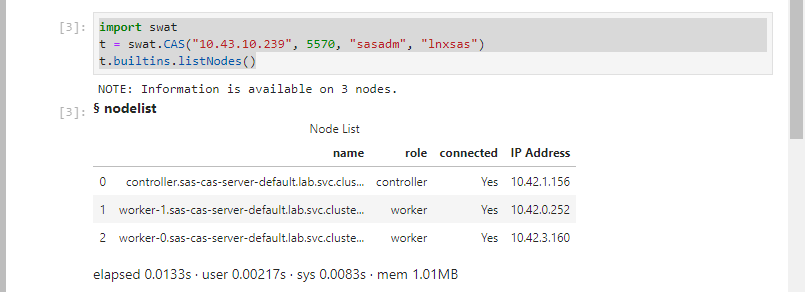
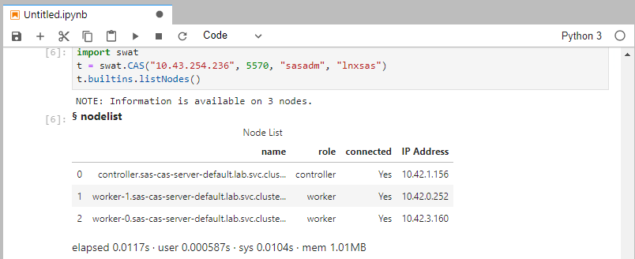
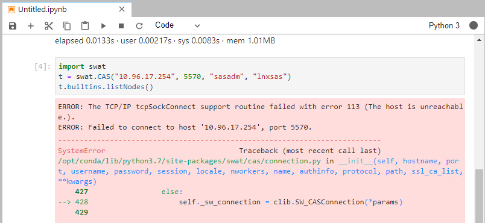

# Connect to CAS from Python and JupyterHub

* [Introduction](#introduction)
* [Review JupyterHub Installation instructions via Helm Chart](#review-jupyterhub-installation-instructions-via-helm-chart)
* [Logon to JupyterHub, create a notebook session and connect to CAS](#logon-to-jupyterhub-create-a-notebook-session-and-connect-to-cas)
  * [Determine host and port](#determine-host-and-port)
  * [Logon to JupyterHub](#logon-to-jupyterhub)
  * [Connect to CAS using HTTP and ClusterIP](#connect-to-cas-using-http-and-clusterip)
  * [Connect to CAS via a binary connection and ClusterIP](#connect-to-cas-via-a-binary-connection-and-clusterip)
  * [Connect to CAS via a binary connection and NodePort](#connect-to-cas-via-a-binary-connection-and-nodeport)
  * [Connect to CAS via a binary connection and LoadBalancer using the CLUSTER-IP](#connect-to-cas-via-a-binary-connection-and-loadbalancer-using-the-cluster-ip)
  * [Connect to CAS via a binary connection and LoadBalancer using the EXTERNAL-IP](#connect-to-cas-via-a-binary-connection-and-loadbalancer-using-the-external-ip)


## Introduction

Many customers have substantial investments in non-SAS programming languages for data science and analytics.  They would like to integrate those languages to leverage SAS Viya's capabilities. As a result there are numerous open-source languages that interact with CAS.

Probably the most common language used is Python. In this hands-on we review the configuration steps required to integrate Python and JupyterHub with CAS and the test the connection in a couple of different ways.

In a containerized world one can expect that a customer may have deployed JupyterHub in a Kubernetes namespace. Therefore, we will briefly review a JupyterHub deployment within the cluster and then test a connection with CAS in the Viya deployment.

The basis for deploying JupyterHub in this workshop is the [Zero to JupyterHub K8S](https://github.com/jupyterhub/zero-to-jupyterhub-k8s)  project.  This project then leads you to the [instructions for deploying and configuring JupyterHub](https://zero-to-jupyterhub.readthedocs.io/en/latest/setup-jupyterhub/setup-jupyterhub.html) for instructions.  The instructions guide the installer to use helm, the package manager for Kubernetes, to deploy the packages in a JupyterHub namespace.

## Review JupyterHub Installation instructions via Helm Chart

Navigate to the JupyterHub installation instructions and review the steps.

[JupyterHub Installation via Helm](https://zero-to-jupyterhub.readthedocs.io/en/latest/setup-jupyterhub/setup-jupyterhub.html)

In the Preparation section

* Which file is created in step 3 of the preparation steps?

In the Installation section

* What action does the first helm command in step 1 take?
* Which version is installed in the example?
* What helm option is specified to perform the actual install?

Let's look at some components of the JupyterHub.

* Retrieve the JupyterHub namespace...

    ```sh
    NS=`kubectl get ns | grep hub`
    ```

* Should return something like this
    ```log
    jhub              Active   24m
    ```

* ...and then review the associated pods
    ```sh
    kubectl -n jhub get pods
    ```

    ```log
    kubectl -n jhub get pods
    NAME                             READY   STATUS    RESTARTS   AGE
    continuous-image-puller-2l9nl    1/1     Running   0          49s
    continuous-image-puller-8hgmf    1/1     Running   0          49s
    continuous-image-puller-mxhwh    1/1     Running   0          49s
    continuous-image-puller-t682x    1/1     Running   0          49s
    continuous-image-puller-wxvmq    1/1     Running   0          49s
    hub-594c88b778-db5x8             1/1     Running   1          49s
    proxy-7bb647b66-xz8gk            1/1     Running   0          49s
    user-scheduler-865b49c54-qpfcr   1/1     Running   0          49s
    user-scheduler-865b49c54-wdpll   1/1     Running   0          49s
    ```

* Review the Docker file used to create the revised Docker image
    ```sh
    cd /home/cloud-user/PSGEL255-deploying-viya-4.0.1-on-kubernetes/scripts/jupyter
    cat jupyter.Dockerfile
    ```

* Should look something like this.  Notice that the "apt-get install" and "pip install" install two key pieces: libnuma1 and swat.  Package libnuma1 is a required Linux package not included with the initial image and swat is the SAS Python package required to access CAS.

    ```log
    FROM jupyterhub/k8s-singleuser-sample:0.9.0
    ARG NB_USER=jovyan
    USER root
    RUN apt-get update && \
      apt-get install -y --no-install-recommends \
      libnuma1 \
      && \
      apt-get purge && apt-get clean
    RUN python3 -m pip install swat
    USER ${NB_USER}
    ```

* Also let's look at the script that creates the config file and performs the install.


    ```sh
    cat /home/cloud-user/PSGEL255-deploying-viya-4.0.1-on-kubernetes/scripts/jupyter/GEL.44.JupyterHub.sh
    ```

* Contents of script with comments

    ```log
    . . .
    . .
    .
    tee /home/cloud-user/PSGEL255-deploying-viya-4.0.1-on-kubernetes/scripts/jupyter/config.yaml > /dev/null <<EOF
    ---
    proxy:
      secretToken: "${SECURETOKEN}"
    hub:
      image:
        name: gelharbor.race.sas.com/jupyter/k8s-singleuser-sample-libnuma
        tag: 0.9.0
      defaultUrl: "/lab"
    EOF

    helm repo add jupyterhub https://jupyterhub.github.io/helm-chart/
    helm repo update

    RELEASE=jhub
    NAMESPACE=jhub

    helm upgrade --cleanup-on-fail \
      --install $RELEASE jupyterhub/jupyterhub \
      --namespace $NAMESPACE \
      --create-namespace \
      --version=0.9.0 \
      --values /home/cloud-user/PSGEL255-deploying-viya-4.0.1-on-kubernetes/scripts/jupyter/config.yaml
    ```

## Logon to JupyterHub, create a notebook session and connect to CAS

### Determine host and port
Since we've just reviewed the JupyterHub deployment, the next step is to connect a JupyterHub/Python session to CAS. But now that Viya is running in a Kubernetes namespace, access to CAS is somewhat obscured.

With a typical Viya 3.x deployment, one only need know the host and the default port.  They are

* 8777 - http connection
* 5570 - binary connection

The same ports are available in a Viya 4 deployment, but may not be accessed in the same manner, or a different port may be used to redirect the requests to the default ports.

A default deployment of Viya 4 will expose both ports via ClusterIP and a NodePort.

* Show the CAS services and ports

    ```sh
    kubectl -n lab get services | grep cas-server
    ```

    ```log
    kubectl -n lab get services | grep cas-server
    sas-cas-server-default                           ClusterIP      None            <none>         <none>                                            45d
    sas-cas-server-default-client                    ClusterIP      10.43.164.203   <none>         5570/TCP,8777/TCP                                 45d
    sas-cas-server-default-extnp                     NodePort       10.43.10.239    <none>         5570:26237/TCP                                    45d
    sas-cas-server-default-lb                        LoadBalancer   10.43.254.236   10.96.17.254   5570:5623/TCP,5571:1170/TCP                       26d
    ```

So we have the default ports, 5570 and 8777, that show for the ***sas-cas-server-default-client***.
* A **ClusterIP** can only be accessed from another namespace in the cluster. If a customer wants to use the ClusterIP, JupyterHub must exist on the same cluster.
* A **NodePort** can be access outside the cluster, but must be accessed using an assigned port (e.g. 26237 shown above). The key thing to remember here is this port number will likely change each time CAS is restarted.
* The final method, **LoadBalancer**, is a service that will probably be the preferred method for most customers. The service for this port must be defined and the IP address is essentially a virtual IP used to redirect the requests.

A load balancer surfaces the IP and port to users external to the cluster while defining a persistent port number. For example, port 5570 can be used. But if more than one Viya instance has been deployed on the cluster then another port will need to be chosen (e.g. 5571). In the example above the customer would access CAS using IP 10.96.17.254 and port 5570.

### Logon to JupyterHub

In the previous section we explained how to find the various IP addresses and ports for CAS. Next we need to figure out how to connect to JupyterHub. Once we have these pieces of information we can connect to CAS from JupyterHub.

When JupyterHub was deployed it required a load balancer as a proxy to it.  We can find the IP address in a similar manner that we did for CAS.

* First we need to find the External IP address of the JupyterHub LoadBalancer

    ```sh
    kubectl -n jhub get services
    ```

    ```logs
    NAME           TYPE           CLUSTER-IP      EXTERNAL-IP    PORT(S)                      AGE
    hub            ClusterIP      10.43.34.18     <none>         8081/TCP                     6h26m
    proxy-api      ClusterIP      10.43.242.120   <none>         8001/TCP                     6h26m
    proxy-public   LoadBalancer   10.43.225.236   10.96.17.252   443:31639/TCP,80:12111/TCP   6h26m
    ```

* Open a browser on the Windows machine
* Enter the EXTERNAL-IP address for the proxy-public server as shown in the previous output (10.96.17.252 in the above example)
* You should be prompted for a username and password. Enter admin/admin. (This is a single-user JupyterHub instance and is not configured to use LDAP/AD for authentication)

  

The default landing screen may seem different than you are used to seeing. That is because the default view is JupyterLab, which is becoming the standard for users of Jupyter Notebooks.

* Select the "Python 3" icon under "Notebooks".

  

* Resulting window should appear as follows.

  

### Connect to CAS using HTTP and ClusterIP

Now let's connect to CAS using the various methods described above.

* First let's retrieve the services defined for CAS.  We did this earlier, but let's do it again to refresh our memory and avoid scrolling backward

    ```sh
    kubectl -n lab get services | grep -E "NAME|cas-server"
    ```

    ```log
    kubectl -n lab get services | grep cas-server
    NAME                                             TYPE           CLUSTER-IP      EXTERNAL-IP    PORT(S)                                           AGE
    sas-cas-server-default                           ClusterIP      None            <none>         <none>                                            45d
    sas-cas-server-default-client                    ClusterIP      10.43.164.203   <none>         5570/TCP,8777/TCP                                 45d
    sas-cas-server-default-extnp                     NodePort       10.43.10.239    <none>         5570:26237/TCP                                    45d
    sas-cas-server-default-lb                        LoadBalancer   10.43.254.236   10.96.17.254   5570:5623/TCP,5571:1170/TCP                       26d
    ```

* First we'll connect using the ClusterIP and HTTP.  In this example the IP is 10.43.164.203.  In the Jupyter Notebook cell add the following code after replacing the IP address with the address from your output. Then select the "Run" button.
**Note: In this example the userid and password are passed as part of the method. The recommended practice is to use a .authinfo file. However, configuring this is the beyond the scope of this hands-on.**

    ```log
    import swat
    t = swat.CAS("10.43.164.203", 8777, "sasadm", "lnxsas", protocol="http")
    t.builtins.history()
    ```

* Your output should appear similar to the following:

  

### Connect to CAS via a binary connection and ClusterIP

* Now let's connect using a binary connection.  Remove the protocol parameter and change the port number to 5570 and enter the following in the subsequent cell. The IP address should not change. Then click the "Run" button.

    ```log
    import swat
    t = swat.CAS("10.43.164.203", 5570, "sasadm", "lnxsas")
    t.builtins.history()
    ```

* Your output should appear similar to the following:

  

### Connect to CAS via a binary connection and NodePort

* Next let's connect using the NodePort. Replace the IP address with the NodePort address.

    ```log
    import swat
    t = swat.CAS("10.43.10.239", 5570, "sasadm", "lnxsas")
    t.builtins.history()
    ```

* Your output should appear similar to the following:

  

### Connect to CAS via a binary connection and LoadBalancer using the CLUSTER-IP

* Now if we try using the CLUSTER IP LoadBalancer IP address we would try the following.

    ```log
    import swat
    t = swat.CAS("10.43.254.236", 5570, "sasadm", "lnxsas")
    t.builtins.history()
    ```

* Your output should appear similar to the following:

  

### Connect to CAS via a binary connection and LoadBalancer using the EXTERNAL-IP


* Let's try one more.  Try connecting using the EXTERNAL-IP address.

    ```log
    import swat
    t = swat.CAS("10.96.17.254", 5570, "sasadm", "lnxsas")
    t.builtins.history()
    ```

* Your output should appear similar to the following:

  

* What happened?  Any idea why it failed?

The IP address, 10.96.17.254, is an External IP address and is intended to be referenced outside of the cluster.  The JupyterHub/Python session is unaware of the External IP and as a result it fails with an error indicating it is unreachable.  If we had a JupyterHub instance running outside of the cluster and there were no firewalls blocking it the connection to CAS would work.
